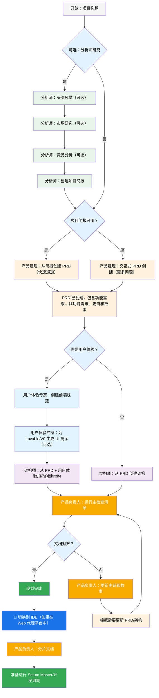
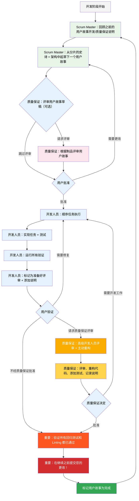

# BMad 方法用户指南

本指南将帮助您理解并有效使用 BMad 方法进行敏捷的 AI 驱动规划和开发。

## BMad 规划和执行工作流

首先，这是完整的标准“绿地”（Greenfield）规划 + 执行工作流。“棕地”（Brownfield）非常相似，但建议您先理解“绿地”，即使只是在一个简单的项目上，然后再处理“棕地”项目。BMad 方法需要安装到您的新项目文件夹的根目录。在规划阶段，您可以选择使用强大的网络代理进行操作，这可能会以更低的成本获得更高质量的结果，比您提供自己的 API 密钥或在某些代理工具中使用积分的成本要低得多。对于规划，强大的思维模型和更大的上下文——以及与代理作为伙伴合作——将获得最佳结果。

如果您打算在“棕地”项目（现有项目）中使用 BMad 方法，请查看 **[在“棕地”中工作](./working-in-the-brownfield.md)**。

如果您没有看到以下渲染的图表，您可以安装 Markdown All in One 和 Markdown Preview Mermaid Support 插件到 VSCode（或其任何分支克隆）。有了这些插件，如果您在打开的标签页上右键单击，应该会有一个“Open Preview”选项，或者查看 IDE 文档。

### 规划工作流（Web UI 或强大的 IDE 代理）

在开发开始之前，BMad 遵循一个结构化的规划工作流，理想情况下在 Web UI 中完成以提高成本效率：



#### Web UI 到 IDE 的过渡

**关键过渡点**：一旦产品负责人确认文档对齐，您必须从 Web UI 切换到 IDE 以开始开发工作流：

1.  **复制文档到项目**：确保 `docs/prd.md` 和 `docs/architecture.md` 位于您项目的 `docs` 文件夹中（或您在安装过程中可以指定的自定义位置）
2.  **切换到 IDE**：在您首选的 Agentic IDE 中打开项目
3.  **文档分片**：使用产品负责人代理对 PRD 和架构进行分片
4.  **开始开发**：开始后续的核心开发周期

### 核心开发周期（IDE）

一旦规划完成且文档分片完毕，BMad 遵循一个结构化的开发工作流：



## 安装

### 可选

如果您想在 Web 上使用 Claude (Sonnet 4 或 Opus)、Gemini Gem (2.5 Pro) 或自定义 GPT 进行规划：

1.  导航到 `dist/teams/`
2.  复制 `team-fullstack.txt`
3.  创建新的 Gemini Gem 或自定义 GPT
4.  上传文件并附带说明：“您的关键操作指令已附上，请按指示不要改变角色”
5.  输入 `/help` 查看可用命令

### IDE 项目设置

```bash
# 交互式安装（推荐）
npx bmad-method install
```

## 特殊代理

BMad 有两个代理——将来它们将合并为单个 bmad-master。

### BMad-Master

这个代理可以执行所有其他代理可以执行的任何任务或命令，除了实际的用户故事实现。此外，当在 Web 中时，这个代理可以通过访问知识库并向您解释关于过程的任何内容来帮助解释 BMad 方法。

如果您不想麻烦地在不同的代理之间切换（除了开发人员代理），那么这就是适合您的代理。请记住，随着上下文的增长，代理的性能会下降，因此重要的是指示代理压缩对话并以压缩后的对话作为初始消息开始新的对话。请经常这样做，最好在每个用户故事实现之后。

### BMad-Orchestrator

这个代理不应该在 IDE 中使用，它是一个重量级的专用代理，它利用大量的上下文并且可以变形为任何其他代理。它仅用于促进 Web bundle 中的团队协作。如果您使用 Web bundle，您将受到 BMad Orchestrator 的欢迎。

### 代理如何工作

#### 依赖系统

每个代理都有一个 YAML 部分，定义其依赖项：

```yaml
dependencies:
  templates:
    - prd-template.md
    - user-story-template.md
  tasks:
    - create-doc.md
    - shard-doc.md
  data:
    - bmad-kb.md
```

**关键点**：

-   代理只加载它们需要的资源（精简上下文）
-   依赖项在打包过程中自动解决
-   资源在代理之间共享以保持一致性

#### 代理交互

**在 IDE 中**：

```bash
# 一些 IDE，例如 Cursor 或 Windsurf，使用手动规则，因此交互通过 '@' 符号完成
@pm 为任务管理应用程序创建 PRD
@architect 设计系统架构
@dev 实现用户身份验证

# 另一些，例如 Claude Code，使用斜杠命令
/pm 创建用户故事
/dev 修复登录错误
```

#### 交互模式

-   **增量模式**：分步进行，需要用户输入
-   **YOLO 模式**：快速生成，交互最少

## IDE 集成

### IDE 最佳实践

-   **上下文管理**：只保留相关文件在上下文中，文件尽可能精简和专注
-   **代理选择**：为任务选择合适的代理
-   **迭代开发**：以小而集中的任务进行工作
-   **文件组织**：保持项目结构整洁
-   **定期提交**：经常保存您的工作

## 技术偏好系统

BMad 包含一个通过位于 `.bmad-core/data/` 中的 `technical-preferences.md` 文件实现的个性化系统——这可以帮助引导产品经理和架构师推荐您在设计模式、技术选择或您想在这里放置的任何其他方面的偏好。

### 与 Web Bundles 一起使用

创建自定义 Web bundles 或上传到 AI 平台时，请包含您的 `technical-preferences.md` 内容，以确保代理从任何对话开始就拥有您的偏好。

## 核心配置

`bmad-core/core-config.yaml` 文件是一个关键配置，使 BMad 能够与不同的项目结构无缝协作，未来将提供更多选项。目前最重要的是 yaml 中的 `devLoadAlwaysFiles` 列表部分。

### 开发人员上下文文件

定义开发人员代理应始终加载的文件：

```yaml
devLoadAlwaysFiles:
  - docs/architecture/coding-standards.md
  - docs/architecture/tech-stack.md
  - docs/architecture/project-structure.md
```

您需要从分片您的架构中验证这些文档是否存在，它们尽可能精简，并包含您希望开发人员代理始终加载到其上下文中的确切信息。这些是代理将遵循的规则。

随着项目的发展和代码开始形成一致的模式，编码标准应减少到只包含代理仍然需要处理的标准。代理将查看文件中周围的代码，以推断与当前任务相关的编码标准。

## 获取帮助

-   **Discord 社区**：[加入 Discord](https://discord.gg/gk8jAdXWmj)
-   **GitHub Issues**：[报告 Bug](https://github.com/bmadcode/bmad-method/issues)
-   **文档**：[浏览文档](https://github.com/bmadcode/bmad-method/docs)
-   **YouTube**：[BMadCode 频道](https://www.youtube.com/@BMadCode)

## 结论

请记住：BMad 旨在增强您的开发过程，而不是取代您的专业知识。将其作为一个强大的工具，以加速您的项目，同时保持对设计决策和实现细节的控制。