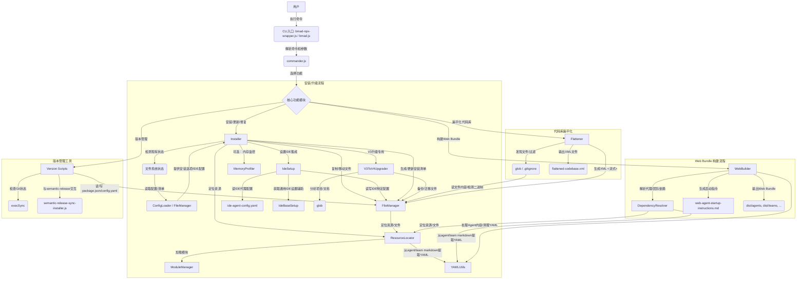

# BMad-Method 命令行工具架构与实现模式分析报告

## 1. 引言
本报告旨在对 BMad-Method 项目中的命令行工具进行深入分析，涵盖其功能、技术栈、输入/输出、核心逻辑，并总结其整体架构、模块划分、职责分配、关键数据流以及常见的实现模式。

## 2. 各工具概述

### 2.1. `tools/yaml-format.js`
*   **功能：** 格式化和校验 YAML 文件以及 Markdown 中嵌入的 YAML 内容，确保格式一致性和语法正确性。
*   **技术栈：** Node.js, `fs`, `path`, `js-yaml`, `child_process` (用于 `yaml-lint`), `chalk`, `glob`。
*   **输入/输出：** 输入文件路径（支持 glob），输出格式化后的文件内容（直接修改原文件），控制台日志（成功/错误信息），错误退出码。
*   **核心逻辑：** 自动修复常见 YAML 问题（如冒号间隔、缩进），解析并重新 dump YAML 以统一格式，从 Markdown 中提取 YAML 块进行处理，调用外部 `yaml-lint` 进行校验。

### 2.2. `tools/version-bump.js`
*   **功能：** 管理项目版本号，但其核心作用是强制执行自动化版本管理策略（`semantic-release` 和约定式提交），不进行手动版本修改，并检查 Git 工作目录的干净状态。
*   **技术栈：：** Node.js, `fs`, `child_process` (用于 Git 命令), `chalk`。
*   **输入/输出：** 命令行可选参数（bump 类型），读取 `package.json` 和 Git 状态，输出控制台警告（禁用手动修改），指导信息（约定式提交用法），错误信息（工作目录不干净），非零退出码（错误时）。
*   **核心逻辑：：** 读取 `package.json` 版本；执行 `git diff-index` 检查工作区；无论输入何种 bump 类型，都只会打印自动化版本管理说明，并返回 `null`。

### 2.3. `tools/update-expansion-version.js` 和 `tools/bump-expansion-version.js`
*   **功能：**
    *   `tools/update-expansion-version.js`：将指定扩展包的版本号直接更新为特定值。
    *   `tools/bump-expansion-version.js`：根据指定的递增类型（`major`/`minor`/`patch`）自动递增指定扩展包的版本号。
*   **技术栈：：** Node.js, `fs`, `path`, `js-yaml`。
*   **输入/输出：**
    *   `update-expansion-version.js`：输入 `<expansion-pack-id> <new-version>`，输出修改后的 `config.yaml`，成功/错误日志。
    *   `bump-expansion-version.js`：输入 `<expansion-pack-id> [bumpType]`，输出修改后的 `config.yaml`，成功/错误日志（扩展包未找到时会列出可用扩展包）。
*   **核心逻辑：：** 两个脚本都读取扩展包的 `config.yaml`，修改 `version` 字段，然后写回。`bump-expansion-version.js` 额外包含版本号计算逻辑。

### 2.4. `tools/sync-installer-version.js` 和 `tools/semantic-release-sync-installer.js`
*   **功能：**
    *   `tools/sync-installer-version.js`：将项目主 `package.json` 的版本号同步到 `tools/installer/package.json`。
    *   `tools/semantic-release-sync-installer.js`：作为 `semantic-release` 插件，在发布流程中将安装器 `package.json` 的版本更新为 `semantic-release` 计算出的下一个发布版本。
*   **技术栈：：** Node.js, `fs`, `path`, `child_process` (`semantic-release-sync-installer.js` 依赖 `semantic-release` 上下文)。
*   **输入/输出：** 均修改 `tools/installer/package.json`，并输出控制台日志。
*   **核心逻辑：：** 两者都读取主 `package.json` 或 `semantic-release` 提供的版本，然后更新安装器的 `package.json`。

### 2.5. `tools/cli.js`
*   **功能：** BMad-Method 项目的核心命令行工具（`bmad-build`），提供构建 Web bundles、列出可用代理/团队、验证配置和项目升级等功能。
*   **技术栈：：** Node.js, `commander`, `WebBuilder`, `V3ToV4Upgrader`, `IdeSetup` (仅导入)。
*   **输入/输出：** 命令行命令和选项，输出控制台日志，构建产物（Web bundles），错误信息，退出码。
*   **核心逻辑：：** 使用 `commander.js` 定义 `build` (构建代理/团队/扩展包 bundle)、`build:expansions`、`list:agents`、`list:expansions`、`validate` (验证代理/团队配置)、`upgrade` (V3 到 V4 升级) 等子命令，并将具体任务委托给 `WebBuilder` 和 `V3ToV4Upgrader` 等模块。

### 2.6. `tools/bmad-npx-wrapper.js`
*   **功能：：** BMad-Method CLI 的 `npx` 包装器，确保当 `bmad-method` 命令通过 `npx` 从 GitHub 仓库执行时，能够正确找到并运行实际的安装器脚本。
*   **技术栈：：** Node.js, `child_process` (`execSync`), `path`, `fs`。
*   **输入/输出：：** `npx` 传递的命令行参数，输出实际 CLI 脚本的输出，错误日志。
*   **核心逻辑：：** 检测是否在 `npx` 临时目录中运行，根据环境动态选择执行方式（`execSync` 或 `require()`），并正确处理路径和工作目录。

### 2.7. `tools/upgraders/v3-to-v4-upgrader.js`
*   **功能：：** 将 BMad-Method V3 项目升级到 V4 版本，包括项目验证、备份旧文件、安装新的 V4 核心结构和迁移重要文档。
*   **技术栈：：** Node.js (`fs.promises`), `path`, `glob`, `chalk`, `ora`, `inquirer`, `file-manager`。
*   **输入/输出：：** V3 项目路径，用户交互选择，输出文件系统修改（备份、复制、创建新结构），控制台日志（进度、成功/失败），退出码。
*   **核心逻辑：：** 验证 V3 结构；分析项目文档；创建 `.bmad-v3-backup` 备份；复制新的 `.bmad-core` 结构；迁移 PRD、架构、用户故事和史诗文件到新 `docs` 结构；创建 `install-manifest.yaml`。

### 2.8. `tools/md-assets/web-agent-startup-instructions.md`
*   **功能：：** 不是可执行工具，而是 Markdown 格式的文档资产。其作用是为在 Web 环境中运行的 BMad-Method AI 代理提供启动指令和行为指南，指导代理如何理解其操作环境、导航资源以及遵循核心指令。
*   **技术栈：：** Markdown。
*   **输入/输出：：** 作为 Web bundle 的一部分嵌入到 AI 代理的运行时上下文中。
*   **核心逻辑：：** 包含代理的身份定义、强制启动命令、资源导航规则（START/END 标签）、YAML 引用理解和执行上下文约束等说明。

### 2.9. `tools/lib/yaml-utils.js`
*   **功能：：** 提供实用函数，用于从代理的 Markdown 文件中提取 YAML frontmatter 内容，并可选地对其进行清理（如移除命令描述）。
*   **技术栈：：** Node.js, 正则表达式, 字符串操作。
*   **输入/输出：：** 代理 Markdown 文件的内容，输出提取并清理后的 YAML 字符串或 `null`。
*   **核心逻辑：：** 使用正则表达式匹配 Markdown 中的 YAML 代码块，并进行可选的文本清理。

### 2.10. `tools/lib/dependency-resolver.js`
*   **功能：：** 负责解析 BMad-Method 代理和代理团队的依赖关系。它能识别配置中声明的任务、模板、清单等资源，并从 `bmad-core`、`common` 和 `expansion-packs` 等来源加载这些资源，并支持缓存。
*   **技术栈：：** Node.js (`fs.promises`), `path`, `js-yaml`, `yaml-utils`。
*   **输入/输出：：** 项目根目录，代理/团队 ID，输出包含解析后的代理/团队信息及其所有资源的复杂对象。
*   **核心逻辑：：** 递归解析代理和团队的 YAML 配置，查找其声明的依赖项；按优先级（扩展包 -> 核心 -> common）加载资源；使用 Map 进行资源去重和缓存。

### 2.11. `tools/flattener/main.js`
*   **功能：：** 将整个代码库（或指定目录）扁平化为单个 XML 文件，其中包含所有非二进制文本文件的内容，旨在为 LLM 提供结构化的项目上下文。
*   **技术栈：：** Node.js, `commander`, `fs-extra`, `path`, `glob`, `minimatch`, `ora` (动态导入), Node.js Streams。
*   **输入/输出：：** 输入目录、输出 XML 文件路径（默认为 `flattened-codebase.xml`），输出 XML 文件内容，控制台日志（进度、统计信息）。
*   **核心逻辑：：** 发现文件（排除 .gitignore 和常见忽略模式），检测二进制文件，聚合文本文件内容，使用流式写入生成 XML 文件（处理 CDATA），并提供代码统计信息。

### 2.12. `tools/builders/web-builder.js`
*   **功能：：** 为 AI 代理和团队创建特殊的“Web bundles”，这些是包含了代理所有代码和配置的单一文本文件，用于在 Web 环境（如 ChatGPT、Claude 等）中运行。
*   **技术栈：：** Node.js (`fs.promises`), `path`, `js-yaml`, `DependencyResolver`, `yamlUtils`。
*   **输入/输出：：** 项目根目录，代理/团队/扩展包 ID，输出 Web bundle 文件到 `dist/` 目录，控制台日志。
*   **核心逻辑：：** 解析代理/团队依赖；生成 Web bundle 的指令头部；格式化各个模块（代理配置、任务、模板）内容并添加 START/END 标记；特殊处理代理 YAML（清理冗余字段）；处理扩展包资源的覆盖逻辑。

### 2.13. `tools/installer/` 目录下的关键文件概述
#### 2.13.1. `tools/installer/package.json`
*   **功能：：** 定义安装器模块的元数据、依赖、脚本和入口点。
*   **技术栈：：** JSON。
*   **输入/输出：：** 作为配置元数据被读取，定义了 `bin` 和 `main` 入口。
*   **核心逻辑：：** 描述了安装器的名称、版本、依赖和可执行命令。

#### 2.13.2. `tools/installer/lib/installer.js`
*   **功能：：** BMad-Method 的核心安装器类，负责整个框架的安装、更新、修复和状态管理，处理各种安装场景和 IDE 集成。
*   **技术栈：：** Node.js, `fs-extra`, `path`, `chalk`, `ora`, `inquirer`，并依赖 `file-manager`, `config-loader`, `ide-setup`, `yaml-utils`, `resource-locator`。
*   **输入/输出：：** 安装配置，用户交互，输出文件系统修改（复制、创建目录、manifest），控制台日志。
*   **核心逻辑：：** 状态检测（全新、V4 现有、V3 现有、未知），根据状态分发到不同安装策略（全新安装、更新、修复、升级），协调文件复制、IDE 设置、Web bundle 部署和清单创建。

#### 2.13.3. `tools/installer/lib/file-manager.js`
*   **功能：：** 封装各种文件系统操作，提供文件/目录复制、哈希计算、清单管理、完整性检查、备份、内容替换等功能。
*   **技术栈：：** Node.js (`fs-extra`, `crypto`, Streams), `path`, `js-yaml`, `chalk`, `resource-locator`。
*   **输入/输出：：** 文件路径、目录路径、内容，输出文件系统修改，返回操作结果，控制台日志。
*   **核心逻辑：：** 大文件流式复制、文件哈希计算用于完整性检查、创建/读取安装清单、文件内容中的 `{root}` 占位符替换。

#### 2.13.4. `tools/installer/lib/config-loader.js`
*   **功能：：** 负责加载和提供安装器的各种配置信息，包括安装选项、IDE 配置，以及动态获取可用代理、扩展包和团队的元数据及依赖。
*   **技术栈：：** Node.js, `fs-extra`, `path`, `js-yaml`, `yaml-utils`, `dependency-resolver` (动态加载)。
*   **输入/输出：：** `install.config.yaml`，各种代理/团队文件，输出配置对象、列表。
*   **核心逻辑：：** 懒加载 `install.config.yaml`；从 Markdown/YAML 文件中提取代理/扩展包/团队的元数据；利用 `DependencyResolver` 获取代理/团队的深层依赖。

#### 2.13.5. `tools/installer/lib/ide-setup.js`
*   **功能：：** 为各种 IDE 设置 BMad-Method 代理的集成规则，在项目目录中创建或修改 IDE 特定文件（如代理规则、命令、设置）。
*   **技术栈：：** Node.js, `path`, `fs-extra`, `js-yaml`, `chalk`, `inquirer`, `file-manager`, `config-loader`, `yaml-utils`, `BaseIdeSetup`, `resource-locator`。
*   **输入/输出：：** IDE ID，安装目录，可选的代理 ID，输出 IDE 特定文件系统修改，控制台日志。
*   **核心逻辑：：** 根据 IDE 类型分发到不同的设置方法（Cursor, Claude Code, Roo, Cline, Gemini, GitHub Copilot 等）；生成包含代理 YAML 和说明的 IDE 特定文件；处理 `ide-agent-config.yaml` 定义的权限和顺序；特殊处理 GitHub Copilot 的 VS Code `settings.json` 配置。

#### 2.13.6. `tools/installer/lib/resource-locator.js`
*   **功能：：** 单例模块，负责 BMad-Method 资源路径解析和缓存，高效定位 `bmad-core`、`expansion-packs`、`common` 中的各类资源。
*   **技术栈：：** Node.js, `path`, `fs-extra`, `module-manager` (用于动态加载 glob), `js-yaml`, `yaml-utils`。
*   **输入/输出：：** 资源 ID/模式，输出文件路径或资源对象，内部缓存数据。
*   **核心逻辑：：** 路径计算和缓存（`_pathCache`, `_globCache`）；分层查找（`bmad-core` -> 扩展包）；从文件 YAML 中提取元数据。

#### 2.13.7. `tools/installer/lib/module-manager.js`
*   **功能：：** 单例模块，用于集中管理 ES 模块的动态导入和缓存，优化模块加载性能。
*   **技术栈：：** Node.js, 动态 `import()`, `Map`。
*   **输入/输出：：** 模块名称，输出模块实例。
*   **核心逻辑：：** 惰性加载；加载中 Promise 缓存防止重复加载；`Promise.all` 并行加载多个模块。

#### 2.13.8. `tools/installer/lib/memory-profiler.js`
*   **功能：：** 单例模块，用于在应用程序执行期间跟踪和报告内存使用情况，提供内存检查点、摘要、增长分析和潜在泄漏推断。
*   **技术栈：：** Node.js (`v8`, `process.memoryUsage()`)。
*   **输入/输出：：** 检查点标签，输出内存统计对象。
*   **核心逻辑：：** 记录内存快照（RSS, Heap Used, Heap Total 等）；计算内存增长；检测持续增长（潜在泄漏）；格式化和解析字节大小。

#### 2.13.9. `tools/installer/lib/ide-base-setup.js`
*   **功能：：** IDE 设置模块的基类，封装了所有 IDE 设置模块通用的功能和辅助方法，如获取代理 ID、查找代理文件路径、提取代理标题以及管理已安装的扩展包。
*   **技术栈：：** Node.js, `path`, `fs-extra`, `js-yaml`, `chalk`, `file-manager`, `resource-locator`, `yaml-utils`。
*   **输入/输出：：** 代理 ID，安装目录，输出代理 ID 列表，文件路径，标题，扩展包列表。
*   **核心逻辑：：** 缓存代理 ID 列表和文件路径；在不同位置查找代理；从代理 YAML 中提取标题；生成通用 IDE 规则内容（如 MDC 格式）。

#### 2.13.10. `tools/installer/config/install.config.yaml`
*   **功能：：** 安装器的主配置文件，定义安装选项、支持的安装类型以及各种 IDE 集成的详细配置。
*   **技术栈：：** YAML。
*   **输入/输出：：** 作为静态配置源被读取，定义了 `installation-options` 和 `ide-configurations`。
*   **核心逻辑：：** 配置驱动安装器的行为和可选项。

#### 2.13.11. `tools/installer/config/ide-agent-config.yaml`
*   **功能：：** 专门用于定义 IDE 特定的代理配置，如 Roo Code 的文件编辑权限和 Cline 的代理显示顺序。
*   **技术栈：：** YAML。
*   **输入/输出：：** 作为静态配置源被读取，定义了 `roo-permissions` 和 `cline-order`。
*   **核心逻辑：：** 提供了代理在特定 IDE 中行为的细粒度配置。

## 3. 整体架构总结

BMad-Method 工具集的整体架构是一个多层、模块化、事件驱动的系统，旨在支持 AI 代理从开发到部署的全生命周期管理。

### 3.1. 模块划分与职责分配

整个系统可以逻辑上划分为以下几个主要模块：

*   **CLI 门面层：：** `tools/cli.js` 和 `tools/bmad-npx-wrapper.js`。
    *   **职责：：** 提供统一的命令行入口，解析用户命令，并根据命令类型将请求分发到相应的业务逻辑模块。`bmad-npx-wrapper.js` 额外处理 `npx` 环境下的路径兼容性。
*   **安装与管理模块：：** 以 `tools/installer/lib/installer.js` 为核心，依赖 `file-manager.js`, `config-loader.js`, `ide-setup.js`, `resource-locator.js`, `module-manager.js`, `memory-profiler.js`, `ide-base-setup.js`。
    *   **职责：：** 负责 BMad-Method 框架及其扩展包的安装、更新、修复、状态检测和 IDE 集成。`file-manager` 处理底层文件操作，`config-loader` 读取配置，`resource-locator` 定位资源，`ide-setup` 进行 IDE 特定配置。
*   **构建模块：：** `tools/builders/web-builder.js`。
    *   **职责：：** 根据 AI 代理和团队配置，将所需资源打包成 Web 环境可用的单一文件 bundle。
*   **核心库/工具模块：：** `tools/lib/dependency-resolver.js`, `tools/lib/yaml-utils.js`。
    *   **职责：：** 提供系统级的通用服务，如解析模块间复杂的依赖关系，以及从特定格式文件中提取 YAML 内容。
*   **辅助/次级工具：：** `tools/yaml-format.js`, `tools/flattener/main.js`, `tools/version-bump.js` 及其相关版本同步脚本。
    *   **职责：：** 提供独立的功能，如代码格式化、代码库扁平化、版本管理和同步等，支持开发和发布流程。
*   **配置数据：：** `tools/installer/config/install.config.yaml`, `tools/installer/config/ide-agent-config.yaml`。
    *   **职责：：** 外部化系统行为和 IDE 集成细节，实现配置驱动的灵活性。
*   **文档资产：：** `tools/md-assets/web-agent-startup-instructions.md`。
    *   **职责：：** 作为 AI 代理运行时指令的一部分，指导 AI 代理在 Web 环境中的行为。

### 3.2. 关键数据流

以下是 BMad-Method 工具集的关键数据流图，展示了模块之间信息的传递和处理过程：

### 3.3. 模块关系

以下是 BMad-Method 工具集的模块关系图，展示了模块之间的调用/依赖关系：

```mermaid
graph TD
    subgraph CLI & Wrapper
        A_cli[tools/bmad-npx-wrapper.js] -- calls --> B_cli(tools/installer/bin/bmad.js)
        B_cli -- uses --> C_cli[tools/cli.js]
    end

    subgraph Core Commands & Logic
        C_cli -- uses --> D_core[tools/builders/web-builder.js]
        C_cli -- uses --> E_core[tools/upgraders/v3-to-v4-upgrader.js]
        C_cli -- uses --> F_core[tools/installer/lib/installer.js]
        C_cli -- uses --> G_core[tools/flattener/main.js]
    end

    subgraph Installer Core
        F_core -- uses --> H_inst[tools/installer/lib/file-manager.js]
        F_core -- uses --> I_inst[tools/installer/lib/config-loader.js]
        F_core -- uses --> J_inst[tools/installer/lib/ide-setup.js]
        F_core -- uses --> K_inst[tools/installer/lib/resource-locator.js]
        F_core -- uses --> L_inst[tools/installer/lib/module-manager.js]
        F_core -- uses --> M_inst[tools/installer/lib/memory-profiler.js]
        J_inst -- extends --> N_inst[tools/installer/lib/ide-base-setup.js]
        I_inst -- reads --> O_inst[tools/installer/config/install.config.yaml]
        J_inst -- reads --> P_inst[tools/installer/config/ide-agent-config.yaml]
    end

    subgraph Shared Libraries & Utils
        D_core -- uses --> Q_shared[tools/lib/dependency-resolver.js]
        D_core -- uses --> R_shared[tools/lib/yaml-utils.js]
        Q_shared -- uses --> R_shared
        H_inst -- uses --> K_inst
        H_inst -- uses --> Q_shared
        I_inst -- uses --> R_shared
        I_inst -- uses --> Q_shared
        J_inst -- uses --> K_inst
        J_inst -- uses --> R_shared
        K_inst -- uses --> L_inst
        K_inst -- uses --> R_shared
        G_core -- uses --> L_inst
        G_core -- uses --> H_inst
    end

    subgraph Versioning & Release Tools
        S_ver[tools/version-bump.js]
        T_ver[tools/update-expansion-version.js]
        U_ver[tools/bump-expansion-version.js]
        V_ver[tools/sync-installer-version.js]
        W_ver[tools/semantic-release-sync-installer.js]
        V_ver -- uses --> W_ver
        W_ver -- uses --> H_inst
    end

    subgraph Assets
        X_asset[tools/md-assets/web-agent-startup-instructions.md]
        D_core -- uses --> X_asset
    end

    subgraph External Dependencies Conceptual
        ED1_ext[commander.js]
        ED2_ext[fs-extra]
        ED3_ext[js-yaml]
        ED4_ext[inquirer]
        ED5_ext[ora]
        ED6_ext[glob]
        ED7_ext[minimatch]
        ED8_ext[child_process]
        ED9_ext[crypto]
        ED10_ext[v8]
    end

    C_cli -- uses --> ED1_ext
    D_core -- uses --> ED1_ext & ED2_ext & ED3_ext
    E_core -- uses --> ED2_ext & ED4_ext & ED5_ext & ED6_ext
    F_core -- uses --> ED2_ext & ED3_ext & ED4_ext & ED5_ext
    G_core -- uses --> ED1_ext & ED2_ext & ED6_ext & ED7_ext & ED5_ext
    H_inst -- uses --> ED2_ext & ED3_ext & ED8_ext & ED9_ext & ED6_ext
    I_inst -- uses --> ED2_ext & ED3_ext
    J_inst -- uses --> ED2_ext & ED3_ext & ED4_ext
    K_inst -- uses --> ED2_ext & ED6_ext
    L_inst -- uses --> ED6_ext
    M_inst -- uses --> ED10_ext
    S_ver -- uses --> ED2_ext & ED8_ext
    T_ver -- uses --> ED2_ext & ED3_ext
    U_ver -- uses --> ED2_ext & ED3_ext
    V_ver -- uses --> ED2_ext
    W_ver -- uses --> ED2_ext

    click A_cli "tools/bmad-npx-wrapper.js"
    click B_cli "tools/installer/bin/bmad.js"
    click C_cli "tools/cli.js"
    click D_core "tools/builders/web-builder.js"
    click E_core "tools/upgraders/v3-to-v4-upgrader.js"
    click F_core "tools/installer/lib/installer.js"
    click G_core "tools/flattener/main.js"
    click H_inst "tools/installer/lib/file-manager.js"
    click I_inst "tools/installer/lib/config-loader.js"
    click J_inst "tools/installer/lib/ide-setup.js"
    click K_inst "tools/installer/lib/resource-locator.js"
    click L_inst "tools/installer/lib/module-manager.js"
    click M_inst "tools/installer/lib/memory-profiler.js"
    click N_inst "tools/installer/lib/ide-base-setup.js"
    click O_inst "tools/installer/config/install.config.yaml"
    click P_inst "tools/installer/config/ide-agent-config.yaml"
    click Q_shared "tools/lib/dependency-resolver.js"
    click R_shared "tools/lib/yaml-utils.js"
    click S_ver "tools/version-bump.js"
    click T_ver "tools/update-expansion-version.js"
    click U_ver "tools/bump-expansion-version.js"
    click V_ver "tools/sync-installer-version.js"
    click W_ver "tools/semantic-release-sync-installer.js"
    click X_asset "tools/md-assets/web-agent-startup-instructions.md"
```

## 4. 常见实现模式总结

在对 BMad-Method 工具集进行全面分析后，可以总结出以下几种常见的实现模式：

**4.1. 命令行解析模式 (CLI Parsing Pattern)**
*   **特点：：** 广泛使用 `commander.js` 库，提供统一且易于理解的命令行界面。命令和选项通过 `program.command()` 和 `command.option()` 定义，执行逻辑通过 `action()` 异步处理。
*   **优势：：** 标准化、可扩展、用户友好、分离关注点。

**4.2. 文件操作模式 (File Operations Pattern)**
*   **特点：：** 核心是 `fs`（`fs.promises`）和 `fs-extra` 库的组合。对大文件使用 Node.js `stream` 进行流式处理（如 `flattener` 中的 XML 生成，`file-manager` 中的大文件复制），实现高效内存管理。
*   **优势：：** 高效处理大文件、健壮的错误处理、灵活支持多种文件类型和内容。`file-manager` 封装了复杂的文件操作，并提供了 `root` 占位符替换功能。

**4.3. 依赖管理模式 (Dependency Management Pattern)**
*   **特点：：** 多层级的依赖关系管理。核心是 `dependency-resolver.js`，负责解析代理和团队的所有资源依赖。
*   **实现细节：：**
    *   **多源查找：：** 资源可在 `bmad-core`、`common`、`expansion-packs` 中按优先级查找，支持扩展包资源覆盖核心资源。
    *   **缓存机制：：** `dependency-resolver` 和 `resource-locator` 使用 `Map` 对解析路径和加载资源进行缓存，减少文件 I/O。
    *   **去重：：** 在解析复杂依赖时，利用 `Map` 进行资源去重。
    *   **YAML 配置源：：** YAML 文件被广泛用作定义依赖和配置的源。
*   **优势：：** 模块化、可扩展性、性能优化。

**4.4. 版本控制与发布模式 (Version Control & Release Pattern)**
*   **特点：：** 自动化和半自动化结合的版本管理策略，严格遵循语义化版本和约定式提交。
*   **实现细节：：** 依赖 `semantic-release` 进行自动化发布；通过 `sync-installer-version.js` 和 `semantic-release-sync-installer.js` 确保版本同步；`version-bump.js` 强制使用约定式提交；扩展包版本通过 `config.yaml` 和专用脚本管理；版本操作前检查 Git 仓库状态。
*   **优势：：：** 自动化、规范化、一致性。

**4.5. 日志与错误处理模式 (Logging & Error Handling Pattern)**
*   **特点：：** 提供友好的命令行反馈，并在发生错误时提供清晰的诊断信息和适当的退出行为。
*   **实现细节：：** 广泛使用 `chalk` 进行彩色输出；`ora` 提供进度指示器；所有主要异步操作都包裹在 `try-catch` 中，错误时打印详细信息并以非零退出码退出；提供用户可采取的行动建议。
*   **优势：：** 提升用户体验、提高调试效率、兼容自动化脚本。
