# BMad-Method 命令行工具代码类图分析报告

## 1. 概述

本报告旨在通过 Mermaid 类图的形式，详细分析 `BMad-Method` 命令行工具代码中的所有入口点以及核心类之间的依赖关系。该工具集主要用于项目的构建、安装、升级、版本管理以及辅助开发。

## 2. Mermaid 类图

```mermaid
classDiagram
    direction LR

    %% CLI Tools Main Entry Points
    class CliJs {
        <<executable>>
        + build()
        + buildExpansions()
        + listAgents()
        + listExpansions()
        + validate()
        + upgrade()
    }
    class BmadBinJs {
        <<executable>>
        + install()
        + update()
        + listExpansions()
        + status()
        + flatten()
    }
    class BmadNpxWrapperJs {
        <<executable>>
        - isNpxExecution
        + wrapExecution()
    }

    %% Core Installer Components
    class Installer {
        + install()
        + update()
        + detectInstallationState()
        + performFreshInstall()
        + handleExistingV4Installation()
        + handleV3Installation()
        + handleUnknownInstallation()
        + performUpdate()
        + performRepair()
        + performReinstall()
        + showSuccessMessage()
        + listAgents()
        + listExpansionPacks()
        + showStatus()
        + getAvailableAgents()
        + getAvailableExpansionPacks()
        + getAvailableTeams()
        + installExpansionPacks()
        + resolveExpansionPackCoreDependencies()
        + resolveExpansionPackCoreAgents()
        + getWebBundleInfo()
        + installWebBundles()
        + copyCommonItems()
        + detectExpansionPacks()
        + repairExpansionPack()
        + compareVersions()
        + cleanupLegacyYmlFiles()
        + findInstallation()
        + flatten()
    }
    class FileManager {
        + copyFile()
        + copyDirectory()
        + calculateFileHash()
        + createManifest()
        + readManifest()
        + checkModifiedFiles()
        + checkFileIntegrity()
        + backupFile()
        + ensureDirectory()
        + pathExists()
        + readFile()
        + writeFile()
        + removeDirectory()
        + createExpansionPackManifest()
        + modifyCoreConfig()
        + copyFileWithRootReplacement()
        + copyDirectoryWithRootReplacement()
    }
    class ConfigLoader {
        + load()
        + getInstallationOptions()
        + getAvailableAgents()
        + getAvailableExpansionPacks()
        + getAgentDependencies()
        + getIdeConfiguration()
        + getBmadCorePath()
        + getDistPath()
        + getAgentPath()
        + getAvailableTeams()
        + getTeamPath()
        + getTeamDependencies()
    }
    class IdeSetup {
        + loadIdeAgentConfig()
        + setup()
        + setupCursor()
        + setupClaudeCode()
        + setupClaudeCodeForPackage()
        + setupWindsurf()
        + setupTrae()
        + setupRoo()
        + setupCline()
        + setupGeminiCli()
        + setupGitHubCopilot()
        + configureVsCodeSettings()
    }
    class BaseIdeSetup {
        + getAllAgentIds()
        + getCoreAgentIds()
        + findAgentPath()
        + getAgentTitle()
        + getInstalledExpansionPacks()
        + getExpansionPackAgents()
        + createAgentRuleContent()
        + clearCache()
    }
    class ResourceLocator {
        + getBmadCorePath()
        + getExpansionPacksPath()
        + findFiles()
        + getAgentPath()
        + getAvailableAgents()
        + getExpansionPacks()
        + getTeamConfig()
        + getAgentDependencies()
        + clearCache()
        + getIdeConfig()
    }
    class ModuleManager {
        + initializeCommonModules()
        + getModule()
        + _loadModule()
        + clearCache()
        + getModules()
    }
    class MemoryProfiler {
        + checkpoint()
        + forceGC()
        + getSummary()
        + getDetailedReport()
        + calculateMemoryGrowth()
        + getRecommendations()
        + checkContinuousGrowth()
        + formatBytes()
        + parseBytes()
        + clear()
    }

    %% Build Components
    class WebBuilder {
        + constructor()
        + parseYaml()
        + convertToWebPath()
        + generateWebInstructions()
        + cleanOutputDirs()
        + buildAgents()
        + buildTeams()
        + buildAgentBundle()
        + buildTeamBundle()
        + processAgentContent()
        + formatSection()
        + replaceRootReferences()
        + validate()
        + buildAllExpansionPacks()
        + buildExpansionPack()
        + buildExpansionAgentBundle()
        + buildExpansionTeamBundle()
        + listExpansionPacks()
        + listAgents()
    }
    class V3ToV4Upgrader {
        + upgrade()
        + getProjectPath()
        + validateV3Project()
        + analyzeProject()
        + showPreflightCheck()
        + createBackup()
        + installV4Structure()
        + migrateDocuments()
        + setupIDE()
        + showCompletionReport()
        + pathExists()
        + copyDirectory()
        + createPrdIndex()
        + createInstallManifest()
    }
    class FlattenerMainJs {
        <<executable>>
        + discoverFiles()
        + parseGitignore()
        + isBinaryFile()
        + aggregateFileContents()
        + generateXMLOutput()
        + escapeXml()
        + indentFileContent()
        + splitAndWrapCDATA()
        + calculateStatistics()
        + filterFiles()
    }

    %% Utility Modules
    class YamlUtils {
        + extractYamlFromAgent()
    }

    %% Versioning Scripts
    class YamlFormatJs {
        <<executable>>
        + formatYamlContent()
        + processMarkdownFile()
        + processYamlFile()
        + lintYamlFile()
        + main()
    }
    class VersionBumpJs {
        <<executable>>
        + getCurrentVersion()
        + bumpVersion()
        + main()
    }
    class UpdateExpansionVersionJs {
        <<executable>>
        + updateVersion()
    }
    class SyncInstallerVersionJs {
        <<executable>>
        + syncInstallerVersion()
    }
    class SemanticReleaseSyncInstallerJs {
        + prepare()
    }
    class BumpExpansionVersionJs {
        <<executable>>
        + bumpVersion()
        + updateVersion()
    }
    class BumpAllVersionsJs {
        <<executable>>
        + bumpVersion()
        + bumpAllVersions()
    }

    %% Relationships
    CliJs --> WebBuilder : uses
    CliJs --> V3ToV4Upgrader : uses
    CliJs --> IdeSetup : uses indirectly in comments

    BmadBinJs --> Installer : uses

    BmadNpxWrapperJs ..> BmadBinJs : calls (dynamic)

    Installer --> FileManager : depends
    Installer --> ConfigLoader : depends
    Installer --> IdeSetup : depends
    Installer --> ResourceLocator : depends
    Installer ..> V3ToV4Upgrader : calls (for upgrade)
    Installer ..> YamlUtils : depends

    WebBuilder --> DependencyResolver : depends
    WebBuilder --> YamlUtils : depends
    WebBuilder ..> js-yaml : dynamically imports

    V3ToV4Upgrader --> FileManager : depends
    V3ToV4Upgrader --> IdeSetup : depends
    V3ToV4Upgrader ..> fs.promises : uses
    V3ToV4Upgrader ..> glob : uses
    V3ToV4Upgrader ..> chalk : uses
    V3ToV4Upgrader ..> ora : uses
    V3ToV4Upgrader ..> inquirer : uses

    FlattenerMainJs ..> fs-extra : uses
    FlattenerMainJs ..> glob : uses
    FlattenerMainJs ..> minimatch : uses
    FlattenerMainJs ..> ora : uses

    DependencyResolver --> YamlUtils : depends
    DependencyResolver ..> fs.promises : uses
    DependencyResolver ..> path : uses
    DependencyResolver ..> js-yaml : uses

    IdeSetup <|-- BaseIdeSetup : inherits
    IdeSetup --> FileManager : depends
    IdeSetup --> ConfigLoader : depends
    IdeSetup --> YamlUtils : depends
    IdeSetup --> ResourceLocator : depends
    IdeSetup ..> glob : dynamically imports

    BaseIdeSetup --> FileManager : depends
    BaseIdeSetup --> ResourceLocator : depends
    BaseIdeSetup --> YamlUtils : depends
    BaseIdeSetup ..> js-yaml : uses

    FileManager --> ResourceLocator : depends
    FileManager ..> fs-extra : uses
    FileManager ..> path : uses
    FileManager ..> crypto : uses
    FileManager ..> js-yaml : uses
    FileManager ..> chalk : uses
    FileManager ..> StreamPromises : uses

    ConfigLoader --> YamlUtils : depends
    ConfigLoader --> DependencyResolver : depends
    ConfigLoader ..> fs-extra : uses
    ConfigLoader ..> path : uses
    ConfigLoader ..> js-yaml : uses

    ResourceLocator --> ModuleManager : depends
    ResourceLocator ..> fs-extra : uses
    ResourceLocator ..> path : uses
    ResourceLocator ..> glob : dynamically imports
    ResourceLocator ..> js-yaml : dynamically imports
    ResourceLocator ..> YamlUtils : uses

    ModuleManager ..> chalk : dynamically imports
    ModuleManager ..> ora : dynamically imports
    ModuleManager ..> inquirer : dynamically imports
    ModuleManager ..> glob : dynamically imports

    YamlFormatJs ..> fs : uses
    YamlFormatJs ..> path : uses
    YamlFormatJs ..> js-yaml : uses
    YamlFormatJs ..> child_process : uses
    YamlFormatJs ..> chalk : uses
    YamlFormatJs ..> glob : uses

    VersionBumpJs ..> fs : uses
    VersionBumpJs ..> path : uses
    VersionBumpJs ..> child_process : uses
    VersionBumpJs ..> chalk : uses

    UpdateExpansionVersionJs ..> fs : uses
    UpdateExpansionVersionJs ..> path : uses
    UpdateExpansionVersionJs ..> js-yaml : uses

    SyncInstallerVersionJs ..> fs : uses
    SyncInstallerVersionJs ..> path : uses

    SemanticReleaseSyncInstallerJs ..> fs : uses
    SemanticReleaseSyncInstallerJs ..> path : uses

    BumpExpansionVersionJs ..> fs : uses
    BumpExpansionVersionJs ..> path : uses
    BumpExpansionVersionJs ..> js-yaml : uses

    BumpAllVersionsJs ..> fs : uses
    BumpAllVersionsJs ..> path : uses
    BumpAllVersionsJs ..> js-yaml : uses
```

## 3. 命令行工具入口点

`BMad-Method` 项目的命令行工具主要通过以下几个入口脚本启动：

*   **`tools/cli.js`**: 作为构建工具的主要入口，提供了 `build`、`build:expansions`、`list:agents`、`list:expansions`、`validate` 和 `upgrade` 等命令。它通过 `commander` 库构建 CLI 界面，并将具体逻辑委托给 `WebBuilder` 和 `V3ToV4Upgrader` 等核心类。
*   **`installer/bin/bmad.js`**: 作为安装器的主要入口，提供了 `install`、`update`、`list:expansions`、`status` 和 `flatten` 等命令。它也通过 `commander` 库构建 CLI 界面，并将核心安装逻辑委托给 `Installer` 类。
*   **`tools/bmad-npx-wrapper.js`**: 这是一个用于 `npx` 执行的包装脚本。当用户通过 `npx bmad-method` 命令在非项目根目录执行时，它负责找到并执行 `installer/bin/bmad.js`，确保安装过程的正确启动。
*   **其他独立工具脚本**: 
    *   `yaml-format.js`: YAML 文件格式化和 Linter 工具。
    *   `version-bump.js`: 版本 bumping 辅助脚本，推广 `semantic-release`。
    *   `update-expansion-version.js`: 更新指定扩展包版本。
    *   `sync-installer-version.js`: 同步安装器 `package.json` 版本。
    *   `semantic-release-sync-installer.js`: `semantic-release` 插件，用于版本同步。
    *   `bump-expansion-version.js`: 根据类型 bumping 扩展包版本。
    *   `bump-all-versions.js`: bumping 所有核心和扩展包版本。

这些脚本通过 shebang (`#!/usr/bin/env node`) 和 Node.js 的模块系统 (`require.main === module`) 机制被设计为可直接执行的命令行工具。

## 4. 类和模块依赖关系分析

`BMad-Method` 工具代码展现了清晰的模块化和职责分离。核心功能通过一系列类和辅助模块实现，并通过依赖注入或直接 `require` 的方式建立联系。

**主要类及其职责：**

*   **`Installer`**: 负责整个 BMad-Method 框架的生命周期管理，包括安装、更新、完整性检查和状态报告。
*   **`WebBuilder`**: 专注于构建 Web bundles，处理代理、团队和扩展包的打包逻辑。
*   **`V3ToV4Upgrader`**: 处理项目从 V3 版本到 V4 版本的升级，包括文件迁移、备份和 IDE 设置。
*   **`FlattenerMainJs`**: 代码库扁平化工具，用于将项目文件聚合为 XML 格式。
*   **`DependencyResolver`**: 核心依赖解析器，负责查找和加载代理、团队及其相关资源的依赖。
*   **`FileManager`**: 提供底层的各种文件系统操作，如复制、读写、哈希计算和清单管理。
*   **`ConfigLoader`**: 负责加载各种配置（如安装选项、IDE 配置）和获取可用代理、扩展包、团队的信息。
*   **`IdeSetup`**: 处理不同 IDE（如 Cursor、Claude Code、GitHub Copilot）的集成设置。
*   **`BaseIdeSetup`**: 作为 `IdeSetup` 的基类，提供通用的辅助方法，减少代码重复。
*   **`ResourceLocator`**: 集中管理资源路径的解析和缓存，提高文件查找效率。
*   **`ModuleManager`**: 负责 Node.js ES 模块的动态加载和缓存，优化内存使用。
*   **`MemoryProfiler`**: 用于在执行过程中监控内存使用情况，帮助诊断性能问题。
*   **`YamlUtils`**: 提供 YAML 辅助函数，主要用于从 Markdown 文件中提取 YAML 内容。

**关键依赖关系链：**

*   **CLI -> 核心功能**: 各个命令行入口 (`CliJs`, `BmadBinJs`, `FlattenerMainJs`) 作为用户交互界面，将核心任务委托给 `WebBuilder`, `V3ToV4Upgrader`, `Installer` 等类。
*   **`Installer` 核心**: `Installer` 类是安装逻辑的中心，它广泛依赖 `FileManager` 进行文件操作，依赖 `ConfigLoader` 获取配置，依赖 `IdeSetup` 进行 IDE 特定的设置，并依赖 `ResourceLocator` 查找资源。
*   **依赖解析**: `WebBuilder` 和 `ConfigLoader` 都依赖 `DependencyResolver` 来处理代理和团队的复杂依赖关系。`DependencyResolver` 又反过来依赖 `YamlUtils` 来解析代理配置中的 YAML。
*   **文件系统操作**: `FileManager` 是文件操作的抽象层，被多个核心组件（`Installer`, `IdeSetup`, `BaseIdeSetup`, `ResourceLocator`）广泛使用。
*   **配置加载**: `ConfigLoader` 负责项目配置的加载和解析，是许多功能模块获取配置信息的基础。
*   **IDE 集成**: `IdeSetup` 继承自 `BaseIdeSetup`，并依赖 `FileManager`, `ConfigLoader`, `YamlUtils`, `ResourceLocator` 来实现不同 IDE 的复杂配置逻辑。
*   **动态模块加载**: `ResourceLocator` 和其他一些模块通过 `ModuleManager` 来动态加载 `glob`、`chalk`、`ora`、`inquirer` 等模块，实现了运行时按需加载，降低了启动开销。

## 5. 总结

整个命令行工具代码结构清晰，遵循模块化设计原则。核心功能通过专门的类实现，并辅以各种实用工具类。依赖关系管理合理，通过中心化的 `DependencyResolver` 和 `ResourceLocator` 提高了代码的可维护性和效率。版本管理和自动化发布流程也通过独立的脚本集成到项目中。