# BMad-Method 命令行工具功能流程图分析报告

本报告将 `BMad-Method` 命令行工具的核心功能拆解为独立的流程图，以可视化其操作步骤和关键逻辑流。这些流程图基于对 `帮助文档/tools-类图分析报告.md` 中类图、命令行入口点和模块依赖关系的分析推断。

---

## 1. CLI 工具 - 构建与开发辅助流程 <`CliJs`>

`CliJs` 是命令行工具的主要入口点之一，负责处理与项目构建、扩展包管理和升级相关的命令。它不直接执行复杂逻辑，而是将任务委托给 `WebBuilder`<用于构建和列表功能>和 `V3ToV4Upgrader`<用于升级功能>。

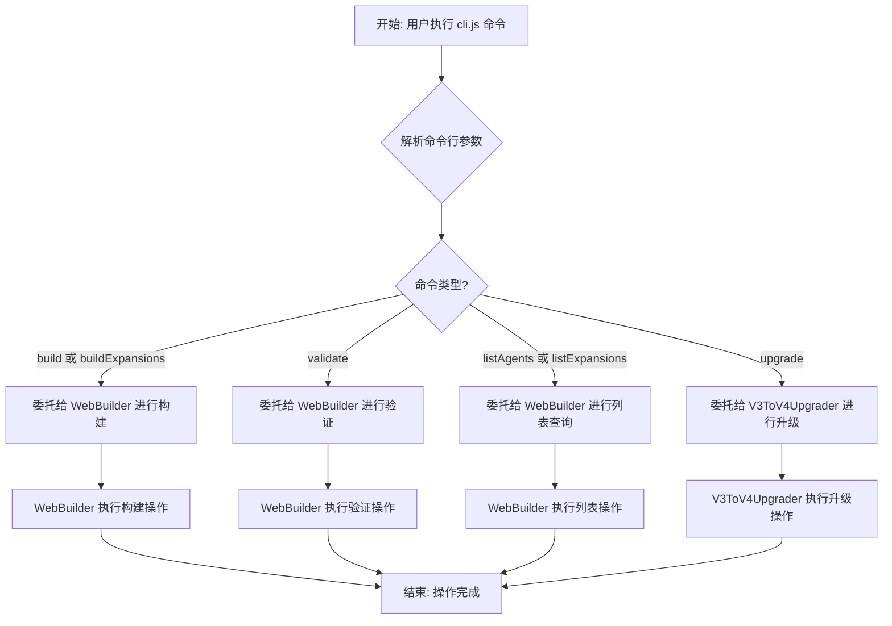

---

## 2. Bmad 安装器 - 安装与更新流程 <`BmadBinJs`>

`BmadBinJs` 是安装器的主要入口点，负责处理安装、更新、状态查询和扁平化等核心安装相关命令。它将这些任务主要委托给 `Installer` 类。

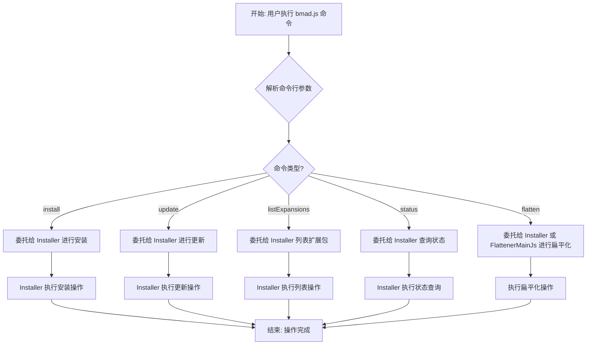

---

## 3. Bmad NPX 包装器流程 <`BmadNpxWrapperJs`>

`BmadNpxWrapperJs` 是一个特殊的包装脚本，其主要职责是当用户通过 `npx` 命令执行 `bmad-method` 时，确保能够正确找到并调用实际的 `installer/bin/bmad.js`。这涉及到一个动态调用过程。

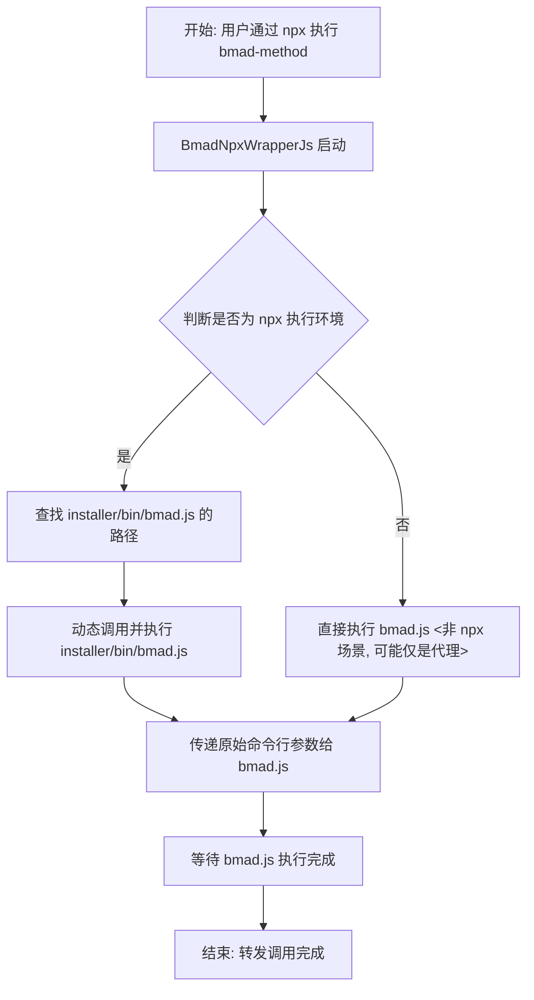

---

## 4. V3 到 V4 升级流程 <`V3ToV4Upgrader`>

`V3ToV4Upgrader` 类负责将旧版本（V3）的项目升级到新版本（V4），涉及多个步骤，包括验证、分析、备份、文件迁移和 IDE 设置。

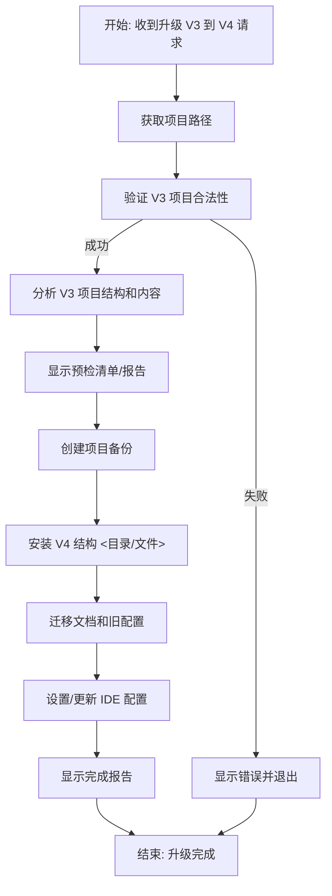

---

## 5. 代码扁平化流程 <`FlattenerMainJs`>

`FlattenerMainJs` 是一个独立工具，用于将项目文件聚合为 XML 格式，通常用于代码分析或传输。它涉及文件发现、过滤、内容聚合和 XML 生成。

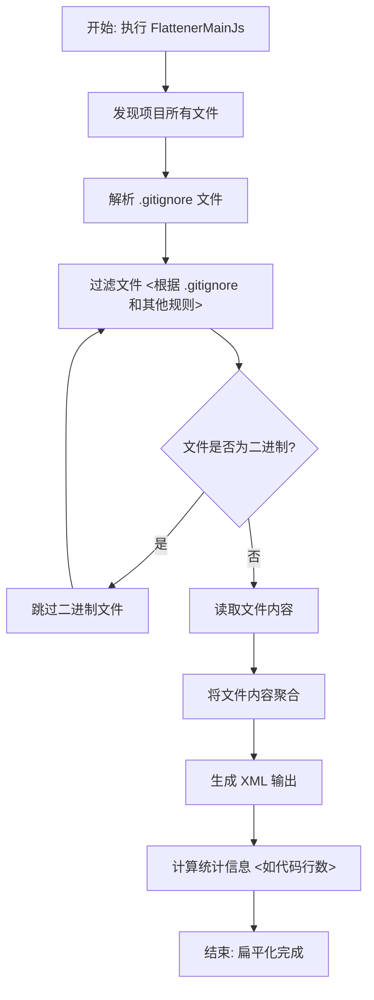

---

## 6. YAML 格式化与 Lint 流程 <`YamlFormatJs`>

`YamlFormatJs` 是一个独立的脚本，用于对 YAML 文件进行格式化和 Linter 检查，以确保其规范性。

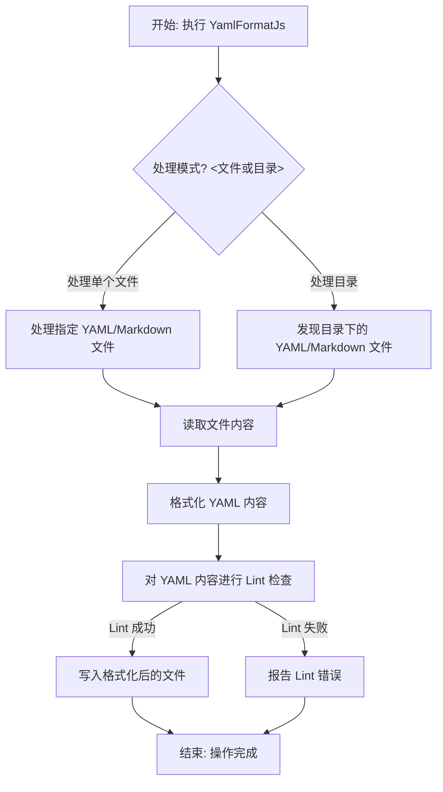

---

## 7. 版本 bumping 辅助流程 <`VersionBumpJs`>

`VersionBumpJs` 辅助脚本主要用于版本号的提升（bumping），以配合 `semantic-release` 等工具进行版本管理。

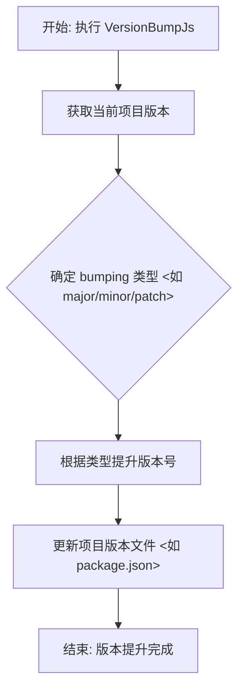

---

## 8. 更新指定扩展包版本流程 <`UpdateExpansionVersionJs`>

`UpdateExpansionVersionJs` 脚本用于更新特定扩展包的版本信息。

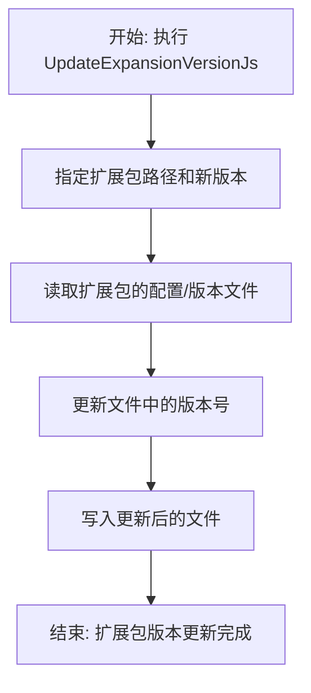

---

## 9. 同步安装器版本流程 <`SyncInstallerVersionJs`>

`SyncInstallerVersionJs` 脚本用于同步安装器 `package.json` 中的版本号，确保一致性。

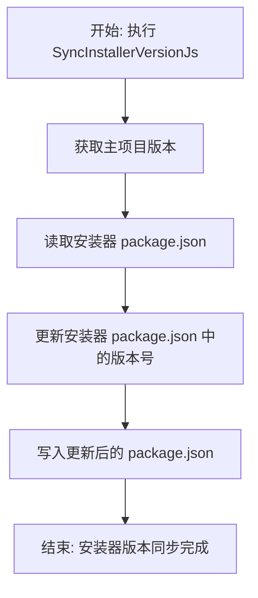

---

## 10. Semantic Release 同步安装器流程 <`SemanticReleaseSyncInstallerJs`>

`SemanticReleaseSyncInstallerJs` 是一个 `semantic-release` 插件，它在发布流程中被调用，用于版本同步。其 `prepare<>` 方法是核心。

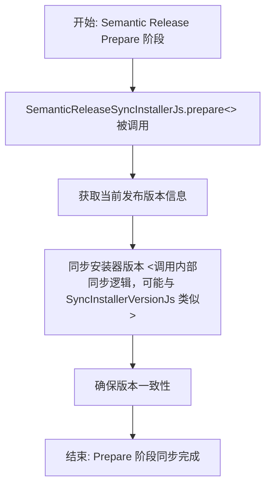

---

## 11. 根据类型 bumping 扩展包版本流程 <`BumpExpansionVersionJs`>

`BumpExpansionVersionJs` 脚本根据指定的 bumping 类型（如 major/minor/patch）来更新扩展包的版本。

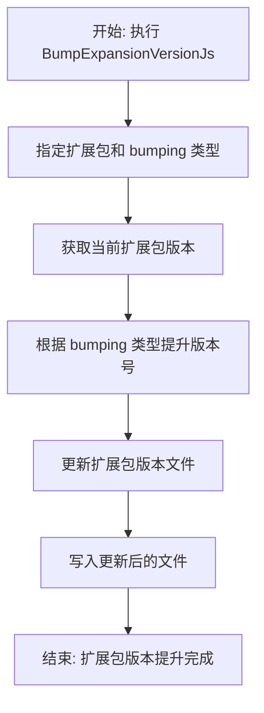

---

## 12. Bumping 所有核心和扩展包版本流程 <`BumpAllVersionsJs`>

`BumpAllVersionsJs` 脚本用于同时提升所有核心模块和扩展包的版本。这通常是一个整体发布或大规模版本更新的一部分。

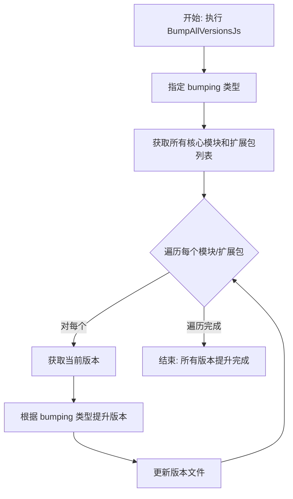

---

## 13. 内存分析流程 <`MemoryProfiler`>

`MemoryProfiler` 类提供内存使用情况的监控和报告功能，用于诊断性能问题。

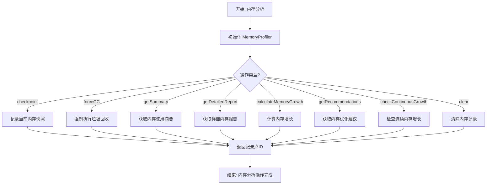

---

## 14. IDE 设置流程 <`IdeSetup`>

`IdeSetup` 类负责处理不同 IDE（如 Cursor、Claude Code、GitHub Copilot）的集成设置，它继承自 `BaseIdeSetup`，并依赖 `FileManager`、`ConfigLoader`、`YamlUtils` 和 `ResourceLocator` 来实现复杂的配置逻辑。

```mermaid
graph TD
    A[开始: 执行 IDE 设置] --> B[加载 IDE 代理配置];
    B --> C{设置类型?};

    C -- setupCursor --> D[设置 Cursor IDE];
    C -- setupClaudeCode --> E[设置 Claude Code IDE];
    C -- setupClaudeCodeForPackage --> F[设置包的 Claude Code IDE];
    C -- setupWindsurf --> G[设置 Windsurf IDE];
    C -- setupTrae --> H[设置 Trae IDE];
    C -- setupRoo --> I[设置 Roo IDE];
    C -- setupCline --> J[设置 Cline IDE];
    C -- setupGeminiCli --> K[设置 Gemini CLI];
    C -- setupGitHubCopilot --> L[设置 GitHub Copilot];
    C -- configureVsCodeSettings --> M[配置 VS Code 设置];

    D --> N[执行特定 IDE 的配置步骤];
    E --> N;
    F --> N;
    G --> N;
    H --> N;
    I --> N;
    J --> N;
    K --> N;
    L --> N;
    M --> N;

    N --> O[结束: IDE 设置完成];