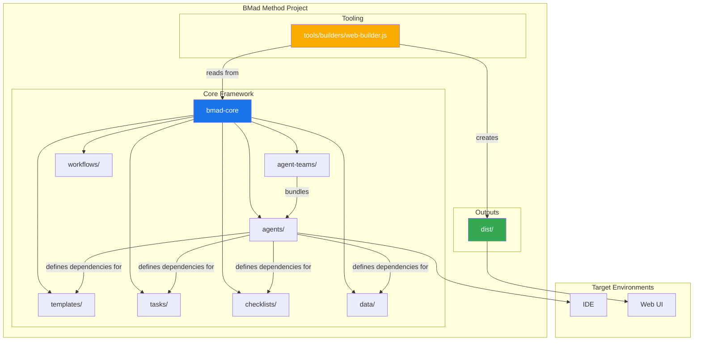
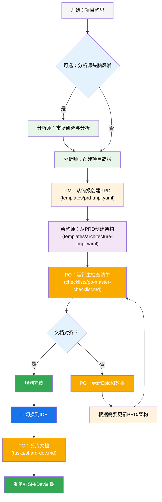
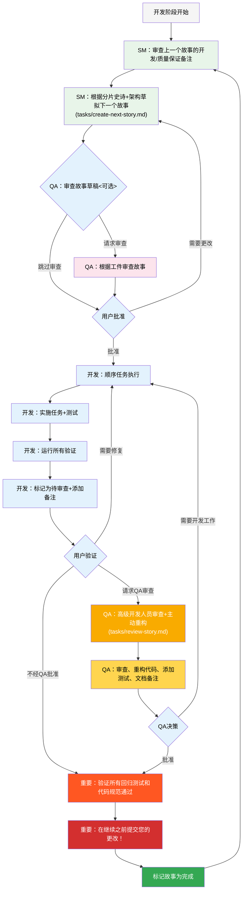
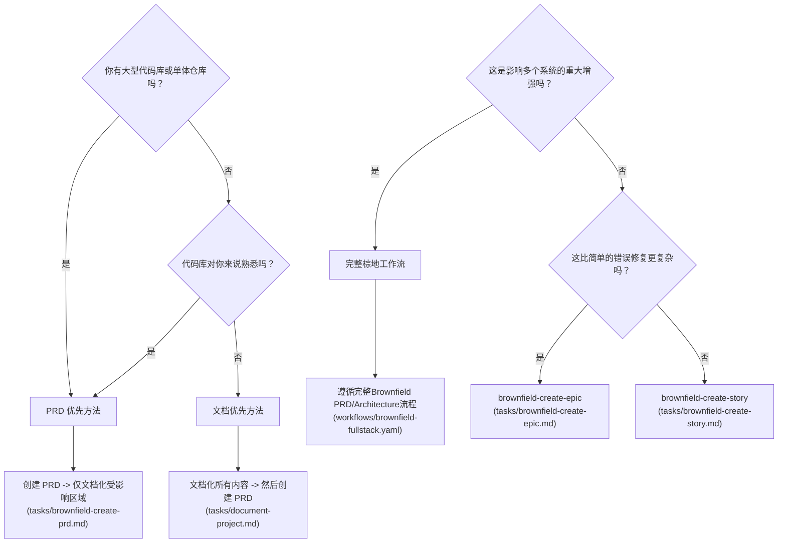
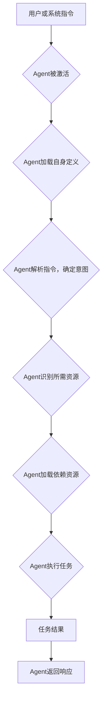
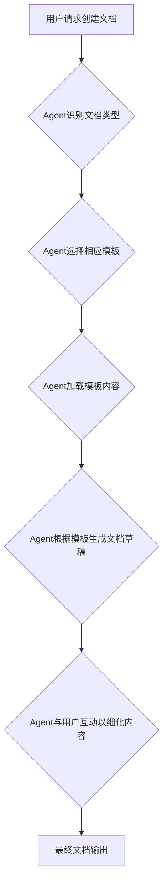
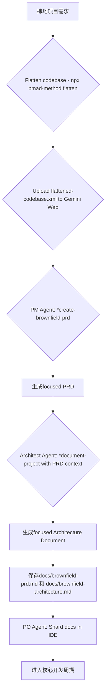

# BMad Method 业务流程分析报告

## 引言

本报告旨在总结BMad Method项目中`docs`目录下的文档内容，并深入分析`bmad-core`模块的核心功能、目录结构、功能依赖项，最终通过业务流程图的形式直观展现其运作机制。BMad Method是一个创新的AI驱动敏捷开发框架，通过结构化的方法论，旨在提升软件开发效率和质量。

## docs 目录下文档内容总结

以下是对`docs`目录下关键文档的总结：

*   **[`docs/core-architecture.md`](docs/core-architecture.md)**：阐述了BMad Method的AI辅助软件开发核心架构，围绕`bmad-core`目录，详细介绍了代理、代理团队、工作流、模板、任务、清单和数据等模块。通过Mermaid图展示了系统架构，并描述了规划和核心开发周期的工作流。
*   **[`docs/expansion-packs.md`](docs/expansion-packs.md)**：解释了扩展包如何将BMad Method的能力延展到软件开发以外的领域。扩展包通过提供特定领域的知识和代理，使核心框架保持精简，并促进了社区创新和专业知识的普及。
*   **[`docs/GUIDING-PRINCIPLES.md`](docs/GUIDING-PRINCIPLES.md)**：概述了BMad Method的核心原则，包括开发代理的精简性、自然语言优先、以及代理和任务的设计。文档为贡献者提供了何时向核心模块添加功能、何时创建扩展包、以及代理、任务和模板的设计与编写规范。
*   **[`docs/how-to-contribute-with-pull-requests.md`](docs/how-to-contribute-with-pull-requests.md)**：一份为项目贡献者准备的指南，详细说明了如何通过GitHub的Pull Request流程来贡献代码，包括Fork、Clone、创建分支、提交更改、推送以及创建PR的步骤，并提供了PR的最佳实践和常见错误规避建议。
*   **[`docs/versioning-and-releases.md`](docs/versioning-and-releases.md)**：介绍了BMad Method项目的版本控制和发布流程，主要推荐使用自动化语义化版本发布，通过特定的提交消息格式（fix:, feat:, feat!:`）触发补丁、次要或主要版本更新，并由GitHub Actions自动处理版本号提升、变更日志生成和NPM发布等操作。

## bmad-core 核心功能与目录结构分析

`bmad-core`目录是BMad Method的大脑，它包含了所有定义和资源，赋予了AI代理强大的能力。其核心功能和目录结构如下：

### 目录结构概览

*   **`agent-teams/`**: 定义代理团队，聚合多个代理以应对特定场景。
*   **`agents/`**: 存放单个AI代理的定义文件，每个文件定义了一个代理的角色、能力和依赖项。
*   **`checklists/`**: 包含各种清单，用于指导代理进行质量保证和流程验证。
*   **`data/`**: 存储核心知识库（`bmad-kb.md`）和技术偏好设置（`technical-preferences.md`）。
*   **`tasks/`**: 定义可重复执行的标准化任务，是代理执行具体操作的指令集。
*   **`templates/`**: 包含各种文档模板，用于生成不同类型的文档，支持内嵌AI指令。
*   **`workflows/`**: 定义预设的工作流，指导用户和代理在不同项目类型中的协作流程。
*   **`core-config.yaml`**: 核心配置文件，用于管理文档路径、分片设置等。
*   **用户指南/流程文档**: `enhanced-ide-development-workflow.md`、`user-guide.md`、`working-in-the-brownfield.md`等，详细说明了系统使用和开发流程。

### 核心功能及其依赖项

1.  **代理管理与协作 (Agents & Agent Teams)**
    *   **功能**: 定义和管理AI代理（如PM、Dev、Architect），并通过团队聚合，协同完成复杂任务。
    *   **依赖项**: 代理依赖于`tasks/`（执行任务）、`templates/`（生成文档）、`checklists/`（验证）、`data/`（知识库和偏好设置）。代理团队依赖`agents/`。

2.  **工作流编排 (Workflows)**
    *   **功能**: 引导用户和代理在特定项目类型中遵循预设的开发流程。
    *   **依赖项**: 依赖`agents/`（参与的代理）、`tasks/`（调用具体任务）、`checklists/`（验证阶段）、`templates/`（生成文档）。

3.  **任务执行 (Tasks)**
    *   **功能**: 提供标准化、可重复的指令集，供代理执行具体操作。
    *   **依赖项**: 可能依赖`templates/`（如果任务是生成文档）、`data/`（如果需要访问数据或知识）。

4.  **文档生成与管理 (Templates & Core Config)**
    *   **功能**: 提供可重用模板来创建各类项目文档，并通过核心配置管理文档的路径和特性。
    *   **依赖项**: `templates/`依赖其定义的文档结构和内嵌指令。`core-config.yaml`影响文档的保存和加载行为。

5.  **知识与偏好管理 (Data)**
    *   **功能**: 存储核心知识库和用户自定义的技术偏好，供代理在决策和建议时参考。
    *   **依赖项**: `agents/`（代理会读取这些数据）、`tasks/`（任务可能需要访问数据）。

6.  **辅助开发流程 (Enhanced IDE Development Workflow)**
    *   **功能**: 指导在IDE环境中，Scrum Master、Developer和QA代理如何协作完成故事的创建、实现和审查。
    *   **依赖项**: 依赖`agents/` (SM, Dev, QA)、`tasks/` (如`create-next-story`, `execute-checklist`, `review-story`)、`checklists/` (如`story-dod-checklist`)。

7.  **棕地项目支持 (Working in the Brownfield)**
    *   **功能**: 提供了针对现有项目（Brownfield）的特殊处理流程，包括代码扁平化、文档化现有系统、以及基于现有代码创建PRD和架构的策略。
    *   **依赖项**: 依赖`tools/flattener/`（代码扁平化工具）、`agents/architect.md`和`agents/pm.md`（用于棕地项目特定的文档和PRD创建任务）、`tasks/document-project.md`、`templates/brownfield-prd-tmpl.yaml`等。

## 业务流程图

### 1. BMad Method 系统架构概览 (包含文件关联 - 括号修复)

### 2. 规划工作流 (The Planning Workflow - 包含文件关联 - 括号修复)

### 3. 核心开发周期 (The Core Development Cycle - 包含文件关联 - 括号修复)

### 4. 增强型 IDE 开发工作流 (Enhanced IDE Development Workflow - 包含文件关联 - 括号修复)

```mermaid
graph TD
    A["增强型开发工作流<br/>(bmad-core/enhanced-ide-development-workflow.md)"] --> B["创建新分支"];
    B --> C["故事创建 <Scrum Master>"];
    C --> C1["开始新对话"];
    C1 --> C2["加载SM代理<br/>(bmad-core/agents/sm.md)"];
    C2 --> C3["执行：*draft<br/>(bmad-core/tasks/create-next-story.md)"];
    C3 --> C4["审查生成的故事<br/>(docs/stories/)"];
    C4 --> C5["更新状态：草稿到批准"];
    C5 --> D["故事实施 <开发人员>"];
    D --> D1["开始新对话"];
    D1 --> D2["加载开发代理<br/>(bmad-core/agents/dev.md)"];
    D2 --> D3["执行：*develop-story {selected-story}<br/>(common/tasks/execute-checklist.md)"];
    D3 --> D4["审查生成的报告"];
    D4 --> E["故事审查 <质量保证>"];
    E --> E1["开始新对话"];
    E1 --> E2["加载QA代理<br/>(bmad-core/agents/qa.md)"];
    E2 --> E3["执行：*review {selected-story}<br/>(bmad-core/tasks/review-story.md)"];
    E3 --> E4["审查生成的报告"];
    E4 --> F["提交更改并推送"];
    F --> F1["提交更改"];
    F1 --> F2["推送到远程"];
    F2 --> G["重复直到完成"];

    style A fill:#f5f5f5,color:#000
    style B fill:#e3f2fd,color:#000
    style C fill:#e8f5e9,color:#000
    style D fill:#fff3e0,color:#000
    style E fill:#fce4ec,color:#000
    style F fill:#d32f2f,color:#fff
    style G fill:#34a853,color:#fff
```

### 5. 棕地项目工作流决策树 (Brownfield Workflow Decision Tree - 包含文件关联 - 括号修复)

### 6. 代理交互与任务执行流程 (包含文件关联 - 括号修复)

### 7. 模板文档生成流程 (包含文件关联 - 括号修复)

### 8. 棕地项目 PRD 优先工作流 (推荐 - 包含文件关联 - 括号修复)

## 结论

BMad Method通过其模块化的`bmad-core`架构、清晰的代理职责划分、以及标准化的任务和工作流，为AI辅助的软件开发提供了强大的支持。其核心功能涵盖了从项目规划、架构设计、开发执行到文档管理的整个生命周期，并通过扩展包机制实现了对多领域的适应性。这份分析报告和业务流程图旨在提供一个全面的视图，帮助陛下理解BMad Method的运作方式及其核心价值。
