# BMad-Method 业务流程分析报告 v2

## 1. `bmad-core` 目录树结构分析

`bmad-core` 目录是 BMad-Method 框架的核心，包含了所有驱动 AI 代理和开发流程的配置文件、代理定义、任务、模板、工作流、清单和数据。其结构清晰，各部分职责明确。

```
bmad-core/
├── agent-teams/          # 代理团队定义 (YAML) - 定义代理组合
├── agents/               # 代理定义 (Markdown) - 定义单个 AI 代理的角色和能力
├── bmad-core/            # （可能是冗余或特定子模块）
├── checklists/           # 任务清单 (Markdown) - 用于验证文档和工作质量
├── core-config.yaml      # 核心配置 (YAML) - 全局配置，定义路径和版本
├── data/                 # 数据/知识库 (Markdown) - 包含知识库、技术偏好等
├── enhanced-ide-development-workflow.md # 增强型 IDE 开发工作流指南
├── tasks/                # 任务定义 (Markdown) - 可执行的自动化指令
├── templates/            # 模板定义 (YAML) - 各种文档的结构模板
├── user-guide.md         # 用户指南
├── workflows/            # 工作流定义 (YAML) - 定义特定项目类型的步骤序列
└── working-in-the-brownfield.md # 旧项目改造指南
```

## 2. 文件功能与依赖项分析

### 2.1 核心配置文件

*   **[`bmad-core/core-config.yaml`](bmad-core/core-config.yaml:1)**:
    *   **功能**: BMad 系统的全局配置中心。定义文档版本 (如 PRD、架构)、分片位置、开发代理加载的文件列表 (`devLoadAlwaysFiles`) 和日志路径等。
    *   **依赖项**: 多个任务文件 (如 `tasks/create-next-story.md`、`tasks/shard-doc.md`) 和代理 (如 `agents/dev.md`) 会读取此文件以获取操作参数和上下文。

### 2.2 顶层文档/指南

*   **[`bmad-core/enhanced-ide-development-workflow.md`](bmad-core/enhanced-ide-development-workflow.md:1)**:
    *   **功能**: 描述了 IDE 内的开发工作流，指导 Scrum Master (SM)、Developer (Dev) 和 Quality Assurance (QA) 代理如何协作。
    *   **依赖项**: 引用 `user-guide.md`，并假定了 `agents/sm.md`、`agents/dev.md`、`agents/qa.md` 及其相关任务的使用。
*   **[`bmad-core/user-guide.md`](bmad-core/user-guide.md:1)**:
    *   **功能**: 用户手册，涵盖规划和执行阶段的工作流、代理角色和安装指南。
    *   **依赖项**: 引用 `working-in-the-brownfield.md`，并介绍了所有核心代理。
*   **[`bmad-core/working-in-the-brownfield.md`](bmad-core/working-in-the-brownfield.md:1)**:
    *   **功能**: 针对现有项目 (Brownfield) 的开发指南，提供了两种主要策略 (PRD-优先和文档-优先) 和相关命令。
    *   **依赖项**: 引用 `user-guide.md` 和 `enhanced-ide-development-workflow.md`。

### 2.3 代理定义 (`agents/*.md`)

*   **功能**: 每个文件定义了一个特定角色的 AI 代理 (如 `analyst`, `architect`, `dev` 等)。它们包含代理的职责、命令 (可执行的任务) 和依赖资源 (模板、任务、清单、数据文件)。
*   **共同依赖项**: 所有代理都依赖于 `IDE-FILE-RESOLUTION` 和 `REQUEST-RESOLUTION` 机制来解析文件和请求。
*   **具体依赖项**: 每个代理文件内部的 `dependencies` 块列出了它所需的具体任务、模板、清单和数据文件。

### 2.4 代理团队定义 (`agent-teams/*.yaml`)

*   **功能**: 这些 YAML 文件定义了不同代理的组合，形成特定的“团队”或“捆绑包”，主要用于 Web UI 环境中的代理打包和部署。
*   **依赖项**: 显式列出团队包含的代理 (通过 ID) 和工作流 (通过文件名)。

### 2.5 工作流定义 (`workflows/*.yaml`)

*   **功能**: 这些 YAML 文件定义了不同项目类型 (新项目 Greenfield，旧项目 Brownfield) 和领域 (全栈、服务、UI) 的预设执行步骤序列。它们协调代理之间的交互和文档的创建/验证。
*   **依赖项**: 显式引用流程中使用的代理 (通过 ID) 和任务 (通过名称)，并指定了步骤的条件和要生成的文档 (引用模板)。

### 2.6 任务定义 (`tasks/*.md`)

*   **功能**: 提供了 BMad 系统中特定可重复操作的详细可执行指令。代理通过调用这些任务来执行具体操作。
*   **依赖项**: 许多任务引用了模板、清单或数据文件。某些任务 (如 `tasks/shard-doc.md`) 还依赖于全局配置 (`core-config.yaml`)。

### 2.7 模板定义 (`templates/*.yaml`)

*   **功能**: 定义了各种文档 (如 PRD、架构文档、报告、用户故事) 的结构和内容。任务文件 (如 `create-doc.md`) 使用这些模板来生成结构化输出。
*   **依赖项**: 这些模板本身不读取其他文件，但它们定义了在任务执行时由代理填充的占位符。有些模板还包含内联的 Mermaid 图代码。

### 2.8 清单定义 (`checklists/*.md`)

*   **功能**: 提供了不同阶段或产物 (如架构、PM、PO、故事草稿、故事完成定义) 的逐步验证标准。它们由 `tasks/execute-checklist.md` 任务使用。
*   **依赖项**: 它们定义了检查其他文档 (如 `prd.md`、`architecture.md`、`story.md`) 或系统状态的准则。

### 2.9 数据/知识库 (`data/*.md`)

*   **功能**: 提供了信息内容或可配置的偏好设置。
*   **依赖项**:
    *   `data/bmad-kb.md`: BMad 的核心知识库，由 `tasks/kb-mode-interaction.md` 任务使用。
    *   `data/brainstorming-techniques.md`: 包含头脑风暴技术列表，由 `tasks/facilitate-brainstorming-session.md` 使用。
    *   `data/elicitation-methods.md`: 包含引导方法列表，由 `tasks/advanced-elicitation.md` 使用。
    *   `data/technical-preferences.md`: 用户定义的技术偏好，可供 PM、Architect、QA、UX Expert 等代理参考。

## 3. 依赖关系图

```mermaid
graph TD
    subgraph 配置
        CFG[bmad-core/core-config.yaml]
    end

    subgraph 文档/指南
        UG[bmad-core/user-guide.md]
        EIDW[bmad-core/enhanced-ide-development-workflow.md]
        WIB[bmad-core/working-in-the-brownfield.md]
    end

    subgraph 代理团队定义
        TA[agent-teams/team-all.yaml]
        TF[agent-teams/team-fullstack.yaml]
        TI[agent-teams/team-ide-minimal.yaml]
        TN[agent-teams/team-no-ui.yaml]
    end

    subgraph 代理定义
        ANA[agents/analyst.md]
        ARC[agents/architect.md]
        BMM[agents/bmad-master.md]
        BMO[agents/bmad-orchestrator.md]
        DEV[agents/dev.md]
        PM[agents/pm.md]
        PO[agents/po.md]
        QA[agents/qa.md]
        SM[agents/sm.md]
        UX[agents/ux-expert.md]
    end

    subgraph 工作流定义
        BFF[workflows/brownfield-fullstack.yaml]
        BFS[workflows/brownfield-service.yaml]
        BFU[workflows/brownfield-ui.yaml]
        GFF[workflows/greenfield-fullstack.yaml]
        GFS[workflows/greenfield-service.yaml]
        GFU[workflows/greenfield-ui.yaml]
    end

    subgraph 任务定义
        ADV_EL[tasks/advanced-elicitation.md]
        BCRE[tasks/brownfield-create-epic.md]
        BCRS[tasks/brownfield-create-story.md]
        CC[tasks/correct-course.md]
        CDRP[tasks/create-deep-research-prompt.md]
        CNS[tasks/create-next-story.md]
        DP[tasks/document-project.md]
        FBS[tasks/facilitate-brainstorming-session.md]
        GAIFP[tasks/generate-ai-frontend-prompt.md]
        ID[tasks/index-docs.md]
        KMID[tasks/kb-mode-interaction.md]
        RS[tasks/review-story.md]
        SD[tasks/shard-doc.md]
        VNS[tasks/validate-next-story.md]
    end

    subgraph 模板定义
        ARCH_T[templates/architecture-tmpl.yaml]
        BO_T[templates/brainstorming-output-tmpl.yaml]
        BF_ARCH_T[templates/brownfield-architecture-tmpl.yaml]
        BF_PRD_T[templates/brownfield-prd-tmpl.yaml]
        COMP_ANA_T[templates/competitor-analysis-tmpl.yaml]
        FE_ARCH_T[templates/front-end-architecture-tmpl.yaml]
        FE_SPEC_T[templates/front-end-spec-tmpl.yaml]
        FS_ARCH_T[templates/fullstack-architecture-tmpl.yaml]
        MR_T[templates/market-research-tmpl.yaml]
        PRD_T[templates/prd-tmpl.yaml]
        PB_T[templates/project-brief-tmpl.yaml]
        STORY_T[templates/story-tmpl.yaml]
    end

    subgraph 清单定义
        ARCH_CL[checklists/architect-checklist.md]
        CHG_CL[checklists/change-checklist.md]
        PM_CL[checklists/pm-checklist.md]
        PO_M_CL[checklists/po-master-checklist.md]
        SDOD_CL[checklists/story-dod-checklist.md]
        SDRAFT_CL[checklists/story-draft-checklist.md]
    end

    subgraph 数据/知识库
        BMAD_KB[data/bmad-kb.md]
        BT[data/brainstorming-techniques.md]
        EM[data/elicitation-methods.md]
        TP[data/technical-preferences.md]
    end

    %% 全局依赖
    CFG --> DEV
    CFG --> CNS
    CFG --> SD

    %% 文档/指南依赖
    UG --> WIB
    EIDW --> UG

    %% 代理团队依赖
    TA --> ANA
    TA --> ARC
    TA --> BMM
    TA --> BMO
    TA --> DEV
    TA --> PM
    TA --> PO
    TA --> QA
    TA --> SM
    TA --> UX
    TA --> BFF
    TA --> BFS
    TA --> BFU
    TA --> GFF
    TA --> GFS
    TA --> GFU

    TF --> ANA
    TF --> PM
    TF --> UX
    TF --> ARC
    TF --> PO
    TF --> BFF
    TF --> BFS
    TF --> BFU
    TF --> GFF
    TF --> GFS
    TF --> GFU

    TI --> PO
    TI --> SM
    TI --> DEV
    TI --> QA

    TN --> ANA
    TN --> PM
    TN --> ARC
    TN --> PO
    TN --> GFS
    TN --> BFS

    %% 代理依赖 (基于命令和角色简化)
    ANA --> CDRP
    ANA --> FBS
    ANA --> DP
    ANA --> ADV_EL
    ANA --> BT
    ANA --> EM
    ANA --> PB_T
    ANA --> MR_T
    ANA --> COMP_ANA_T
    ANA --> BO_T
    ANA --> BMAD_KB

    ARC --> FS_ARCH_T
    ARC --> ARCH_T
    ARC --> FE_ARCH_T
    ARC --> BF_ARCH_T
    ARC --> DP
    ARC --> CDRP
    ARC --> ARCH_CL
    ARC --> TP

    BMM --> ADV_EL
    BMM --> FBS
    BMM --> BCRE
    BMM --> BCRS
    BMM --> CC
    BMM --> CDRP
    BMM --> CNS
    BMM --> DP
    BMM --> GAIFP
    BMM --> ID
    BMM --> RS
    BMM --> SD
    BMM --> ARCH_T
    BMM --> BF_ARCH_T
    BMM --> BF_PRD_T
    BMM --> COMP_ANA_T
    BMM --> FE_ARCH_T
    BMM --> FE_SPEC_T
    BMM --> FS_ARCH_T
    BMM --> MR_T
    BMM --> PRD_T
    BMM --> PB_T
    BMM --> STORY_T
    BMM --> BMAD_KB
    BMM --> BT
    BMM --> EM
    BMM --> TP
    BMM --> BFF
    BMM --> BFS
    BMM --> BFU
    BMM --> GFF
    BMM --> GFS
    BMM --> GFU
    BMM --> ARCH_CL
    BMM --> CHG_CL
    BMM --> PM_CL
    BMM --> PO_M_CL
    BMM --> SDOD_CL
    BMM --> SDRAFT_CL

    BMO --> ADV_EL
    BMO --> KMID
    BMO --> BMAD_KB
    BMO --> EM

    DEV --> SDOD_CL
    DEV --> VNS

    PM --> PRD_T
    PM --> BF_PRD_T
    PM --> BCRE
    PM --> BCRS
    PM --> CC
    PM --> PM_CL
    PM --> CHG_CL
    PM --> TP

    PO --> PO_M_CL
    PO --> SD
    PO --> CC
    PO --> BCRE
    PO --> BCRS
    PO --> VNS
    PO --> STORY_T

    QA --> RS
    QA --> TP
    QA --> STORY_T

    SM --> CNS
    SM --> CC
    SM --> SDRAFT_CL
    SM --> STORY_T

    UX --> FE_SPEC_T
    UX --> GAIFP
    UX --> TP

    %% 工作流依赖 (代理创建文档，使用模板)
    BFF --> ANA
    BFF --> PM
    BFF --> ARC
    BFF --> PO
    BFF --> SM
    BFF --> DEV
    BFF --> QA
    BFF --> BCRS
    BFF --> BCRE
    BFF --> DP
    BFF --> BF_PRD_T
    BFF --> BF_ARCH_T
    BFF --> PO_M_CL
    BFF --> CNS
    BFF --> RS

    BFS --> ARC
    BFS --> PM
    BFS --> PO
    BFS --> SM
    BFS --> DEV
    BFS --> QA
    BFS --> DP
    BFS --> BF_PRD_T
    BFS --> BF_ARCH_T
    BFS --> PO_M_CL
    BFS --> CNS
    BFS --> RS

    BFU --> ARC
    BFU --> PM
    BFU --> UX
    BFU --> PO
    BFU --> SM
    BFU --> DEV
    BFU --> QA
    BFU --> DP
    BFU --> BF_PRD_T
    BFU --> FE_SPEC_T
    BFU --> BF_ARCH_T
    BFU --> PO_M_CL
    BFU --> CNS
    BFU --> RS

    GFF --> ANA
    GFF --> PM
    GFF --> UX
    GFF --> ARC
    GFF --> PO
    GFF --> SM
    GFF --> DEV
    GFF --> QA
    GFF --> PB_T
    GFF --> PRD_T
    GFF --> FE_SPEC_T
    GFF --> FS_ARCH_T
    GFF --> PO_M_CL
    GFF --> CNS
    GFF --> RS
    GFF --> GAIFP

    GFS --> ANA
    GFS --> PM
    GFS --> ARC
    GFS --> PO
    GFS --> SM
    GFS --> DEV
    GFS --> QA
    GFS --> PB_T
    GFS --> PRD_T
    GFS --> ARCH_T
    GFS --> PO_M_CL
    GFS --> CNS
    GFS --> RS

    GFU --> ANA
    GFU --> PM
    GFU --> UX
    GFU --> ARC
    GFU --> PO
    GFU --> SM
    GFU --> DEV
    GFU --> QA
    GFU --> PB_T
    GFU --> PRD_T
    GFU --> FE_SPEC_T
    GFU --> FE_ARCH_T
    GFU --> PO_M_CL
    GFU --> CNS
    GFU --> RS
    GFU --> GAIFP

    %% 任务依赖
    CDRP --> BMAD_KB
    CDRP --> BT
    CDRP --> EM

    CNS --> CFG
    CNS --> STORY_T
    CNS --> SDOD_CL

    DP --> BF_ARCH_T

    FBS --> BO_T
    FBS --> BT

    GAIFP --> FE_SPEC_T
    GAIFP --> FE_ARCH_T
    GAIFP --> FS_ARCH_T
    GAIFP --> ARCH_T

    KMID --> BMAD_KB

    RS --> STORY_T

    SD --> CFG

    VNS --> CFG
    VNS --> STORY_T
    VNS --> ARCH_T
    VNS --> PM_CL

    %% 清单依赖
    ARCH_CL --> ARCH_T
    ARCH_CL --> PRD_T
    ARCH_CL --> FE_ARCH_T

    CHG_CL --> PRD_T
    CHG_CL --> ARCH_T
    CHG_CL --> FE_SPEC_T

    PM_CL --> PRD_T

    PO_M_CL --> PRD_T
    PO_M_CL --> ARCH_T
    PO_M_CL --> FE_ARCH_T
    PO_M_CL --> BF_PRD_T
    PO_M_CL --> BF_ARCH_T

    SDOD_CL --> ARCH_T
    SDOD_CL --> FS_ARCH_T

    SDRAFT_CL --> STORY_T
    SDRAFT_CL --> PRD_T
    SDRAFT_CL --> ARCH_T
```



## 4. BMad-Method 业务流程分析

BMad-Method (Breakthrough Method of Agile AI-driven Development) 是一个旨在通过 AI 代理驱动敏捷开发流程的框架。其核心理念是让用户作为“Vibe CEO”指导专业化的 AI 代理团队，通过结构化的工作流和清晰的文档流转，实现从概念到代码的迭代开发。整个流程划分为两个主要阶段：规划阶段 (Plan) 和开发阶段 (Execute)，并支持新项目 (Greenfield) 和旧项目改造 (Brownfield) 两种场景。

### 4.1 核心理念与分阶段工作流

BMad-Method 的设计宗旨是优化 AI 代理的上下文管理和专业化分工，以提高效率和产出质量。

*   **规划阶段 (Plan)**:
    *   **目标**: 产出全面、一致的开发前文档，如产品需求文档 (PRD)、架构设计文档等。
    *   **环境**: 推荐在 Web UI 环境 (如 Gemini Web, ChatGPT, Claude) 中进行，因为这些平台通常提供更大的上下文窗口和更经济的成本，适合大量文本的生成和交互。
    *   **关键活动**: 市场研究、竞品分析、头脑风暴、需求定义、架构设计、用户体验规范制定。
    *   **产出物**: `docs/prd.md`、`docs/architecture.md`、`docs/front-end-spec.md` 等。

*   **开发阶段 (Execute)**:
    *   **目标**: 将规划文档转化为可执行的代码，并进行迭代实现、测试和质量保障。
    *   **环境**: 主要在 IDE 环境中进行，因为这涉及到文件操作、项目集成和实时的代码修改。
    *   **关键活动**: 文档分片 (Sharding)、用户故事创建、故事实现、代码评审、测试、问题修复。
    *   **产出物**: 更新的代码文件、测试报告、故事完成记录等。

*   **核心配置文件 (`bmad-core/core-config.yaml`)**:
    *   作为整个框架的“指挥中心”，定义了文档版本、分片位置、代理加载文件列表、调试日志路径等关键配置。它确保了不同代理在不同项目和工作流中的行为一致性和可预测性。

### 4.2 关键角色及其职责 (代理 Agent)

BMad-Method 中的每个 AI 代理都扮演着敏捷开发团队中的特定角色，拥有明确的职责和可执行命令。

*   **Analyst (`agents/analyst.md`)**: 负责市场研究、竞品分析、头脑风暴、项目简报创建和现有项目文档化 (Brownfield)。
*   **Product Manager (PM) (`agents/pm.md`)**: 负责 PRD 创建、功能优先级排序和产品策略。
*   **UX Expert (`agents/ux-expert.md`)**: 负责 UI/UX 设计、线框图、原型和前端规范。
*   **Architect (`agents/architect.md`)**: 负责系统设计、技术选型、API 设计和基础设施规划。
*   **Product Owner (PO) (`agents/po.md`)**: 负责待办事项管理、故事细化、验收标准和优先级决策，并对所有文档进行最终验证。
*   **Scrum Master (SM) (`agents/sm.md`)**: 负责故事创建、史诗管理和敏捷流程指导，特别是从 PRD 中提取故事并准备好交给开发者。
*   **Developer (Dev) (`agents/dev.md`)**: 负责代码实现、调试和重构，严格按照故事任务进行开发并更新文件。
*   **QA (`agents/qa.md`)**: 负责高级代码评审、重构、测试计划和质量保证，可在发现问题时直接修复代码。
*   **BMad Orchestrator (`agents/bmad-orchestrator.md`)**: 负责协调多代理工作流、角色切换和提供流程指导。主要用于 Web UI 环境。
*   **BMad Master (`agents/bmad-master.md`)**: 通用型专家，可以在不切换代理的情况下执行任何任务，但通常建议在开发阶段使用专业代理。

**代理团队定义 (`agent-teams/*.yaml`)**:
这些文件定义了特定任务所需的代理组合，例如 `team-fullstack.yaml` 包含了进行全栈开发所需的所有核心代理。

### 4.3 主要文档及其作用

BMad-Method 围绕结构化文档进行驱动，确保信息在团队和阶段间无缝流转。

*   **项目简报 (`templates/project-brief-tmpl.yaml`)**: 项目启动的初步概念文档。
*   **产品需求文档 (PRD) (`templates/prd-tmpl.yaml`, `templates/brownfield-prd-tmpl.yaml`)**: 详细定义产品的功能和非功能需求。
*   **前端规范 (`templates/front-end-spec-tmpl.yaml`)**: 详细描述 UI/UX 设计目标、信息架构、用户流程和视觉规范。
*   **架构文档 (`templates/architecture-tmpl.yaml`, `templates/fullstack-architecture-tmpl.yaml`, `templates/front-end-architecture-tmpl.yaml`, `templates/brownfield-architecture-tmpl.yaml`)**: 定义系统技术栈、组件、数据模型和部署策略。
*   **用户故事 (`templates/story-tmpl.yaml`)**: 将史诗分解为可执行的、小颗粒度的开发任务，包含验收标准和技术指导。
*   **清单 (`checklists/*.md`)**: 提供标准化的验证流程，确保文档和工作的质量 (例如 `architect-checklist.md`, `po-master-checklist.md`, `story-dod-checklist.md`)。
*   **任务 (`tasks/*.md`)**: 定义了如何执行具体操作 (例如 `create-doc.md` 创建文档，`shard-doc.md` 分片文档，`create-next-story.md` 生成故事)。

### 4.4 流程中的关键工具和机制

*   **文档分片 (Document Sharding)**:
    *   **机制**: 通过 `tasks/shard-doc.md` 任务，将大型文档 (如 PRD、架构文档) 分解为更小的、独立的文件块。这些小文件块更容易被 AI 代理加载和处理，优化了上下文管理和成本。
    *   **核心作用**: 在规划阶段完成后，文档会从整体形式 (如 `prd.md`) 分片为细化的模块 (如 `docs/prd/epic-1.md`)，以便开发阶段的 Scrum Master 和 Dev 代理按需加载相关上下文，避免上下文溢出。
*   **清单验证 (Checklist Validation)**:
    *   **机制**: `tasks/execute-checklist.md` 任务结合不同角色的清单 (`checklists/*.md`)，对文档、故事或实现进行系统性检查。
    *   **核心作用**: 确保产出物的质量、完整性和一致性，例如 PO 代理使用 `po-master-checklist.md` 验证整个项目计划的就绪度。
*   **上下文管理 (Context Management)**:
    *   **核心策略**: 通过明确的代理职责划分、文档分片、以及在不同阶段/代理间“新开对话”的约定，最大化 AI 代理的有效上下文，减少无关信息的干扰，提高代理执行效率和准确性。
    *   **DevLoadAlwaysFiles**: `core-config.yaml` 中的 `devLoadAlwaysFiles` 配置允许为开发代理预加载核心技术规范，确保其在实现故事时始终遵循项目标准。
*   **交互模式 (Interactive Mode vs. YOLO Mode)**:
    *   许多任务和工作流支持交互模式 (逐步引导用户确认) 和 YOLO 模式 (快速生成，减少交互)，以适应不同复杂度和用户偏好的任务。
*   **知识库 (`data/bmad-kb.md`)**:
    *   包含了 BMad-Method 自身的运作原理、最佳实践和常见问题解答，代理可在需要时查询以提供指导。

### 4.5 Greenfield (新项目) 工作流

新项目的开发流程从概念验证到最终部署，是一个循序渐进的完整周期。

1.  **项目启动与简报 (`analyst`)**:
    *   `analyst` 代理通过 `tasks/create-doc.md` 和 `templates/project-brief-tmpl.yaml` 创建项目简报，也可选择进行市场研究或头脑风暴。
2.  **需求定义 (`pm`)**:
    *   `pm` 代理基于项目简报，使用 `tasks/create-doc.md` 和 `templates/prd-tmpl.yaml` 创建详细的 PRD。
3.  **UI/UX 规范 (`ux-expert`)**:
    *   如果项目涉及 UI，`ux-expert` 代理会依据 PRD，使用 `tasks/create-doc.md` 和 `templates/front-end-spec-tmpl.yaml` 制定前端规范，甚至可生成 AI UI 提示。
4.  **架构设计 (`architect`)**:
    *   `architect` 代理根据 PRD 和前端规范，使用 `tasks/create-doc.md` 和相应的架构模板 (如 `templates/fullstack-architecture-tmpl.yaml`) 设计系统架构。
5.  **文档验证 (`po`)**:
    *   `po` 代理使用 `tasks/execute-checklist.md` 和 `checklists/po-master-checklist.md` 对所有规划文档进行验证，确保一致性和完整性。若有问题，会返回给相应代理修改。
6.  **文档分片 (`po`)**:
    *   `po` 代理使用 `tasks/shard-doc.md` 将 PRD 和架构文档进行分片，为开发阶段做准备。
7.  **进入开发循环**。

### 4.6 Brownfield (旧项目改造) 工作流

旧项目改造强调对现有代码库的深入理解和安全集成，避免破坏现有功能。

1.  **项目分析与文档化 (`analyst`, `architect`)**:
    *   **核心步骤**: `tasks/document-project.md` 任务用于分析现有代码库，生成反映实际情况 (包括技术债务和变通方案) 的 Brownfield 架构文档。
    *   根据项目规模和复杂性，选择“PRD-优先”或“文档-优先”策略。
2.  **需求定义 (`pm`)**:
    *   `pm` 代理使用 `templates/brownfield-prd-tmpl.yaml` 定义增强功能的需求，关注与现有系统的兼容性。
3.  **架构规划 (`architect`)**:
    *   `architect` 代理使用 `templates/brownfield-architecture-tmpl.yaml` 规划增强功能的架构，重点在于与现有系统的集成策略和迁移计划。
4.  **UI/UX 规范 (`ux-expert`)**:
    *   如果涉及 UI 改造，`ux-expert` 代理会制定相关规范，确保与现有 UI 的一致性。
5.  **文档验证 (`po`)**:
    *   `po` 代理验证所有文档，确保集成安全和设计一致性。
6.  **文档分片 (`po`)**:
    *   `po` 代理对 Brownfield 文档进行分片。
7.  **进入开发循环**。

### 4.7 迭代开发循环 (SM → Dev → QA)

这是 BMad-Method 的核心循环，在 IDE 环境中进行，确保故事的逐步实现和质量保障。

1.  **故事创建 (`sm`)**:
    *   `sm` 代理通过 `tasks/create-next-story.md` (针对分片文档) 或 `tasks/brownfield-create-story.md` (针对 Brownfield 文档) 从史诗中创建下一个用户故事。故事会填充所有必要的上下文和验收标准，并以“Draft”状态保存。
    *   `checklists/story-draft-checklist.md` 用于验证故事草稿的质量。
2.  **故事评审 (用户)**:
    *   用户 (您) 评审故事草稿，确认其准确性和就绪度，并将其状态从“Draft”更改为“Approved”。
3.  **故事实现 (`dev`)**:
    *   `dev` 代理 (在一个新的、干净的聊天会话中) 加载“Approved”状态的故事文件，并严格按照故事中的任务和技术指导进行代码实现。它会更新故事文件中的任务完成状态和文件列表。
    *   `checklists/story-dod-checklist.md` 用于 `dev` 代理自查“完成的定义”。
4.  **代码评审与质量保证 (`qa`)**:
    *   `qa` 代理 (在一个新的、干净的聊天会话中) 执行 `tasks/review-story.md` 任务。它会对开发人员的实现进行高级代码评审，可在发现问题时直接重构和修复代码，并将评审结果记录到故事文件的“QA Results”部分。
    *   如果评审通过，故事状态变为“Done”；否则，仍保留“Review”状态，并指出需要 `dev` 代理解决的问题。
5.  **循环往复**:
    *   这个 SM → Dev → QA 循环会重复进行，直到当前史诗下的所有故事都已完成。

### 4.8 配置与依赖如何支持流程

*   **`core-config.yaml`**: 作为中心配置，它指导了文档如何被查找、解析和使用，确保了不同代理对项目结构和规范的统一理解。
*   **代理内部的 `dependencies` 块**: 每个代理文件 (`agents/*.md`) 中的 `dependencies` 部分明确列出了该代理在执行其任务时所需的所有任务、模板、清单和数据文件。这种显式依赖关系使得代理能够按需加载所需信息，同时保持其核心上下文的精简。
*   **任务对模板和清单的引用**: 任务文件 (`tasks/*.md`) 通常会引用特定的模板 (`templates/*.yaml`) 来生成结构化输出，或引用清单 (`checklists/*.md`) 进行验证，这确保了流程的标准化和自动化。
*   **工作流编排 (`workflows/*.yaml`)**: 工作流文件详细定义了代理如何协同工作、何时创建或更新特定文档、以及在何种条件下进行状态流转，从而将整个开发过程系统化。

---

通过这种模块化、代理化和文档驱动的机制，BMad-Method 旨在为用户提供一个高效、可控且可扩展的 AI 辅助开发框架。