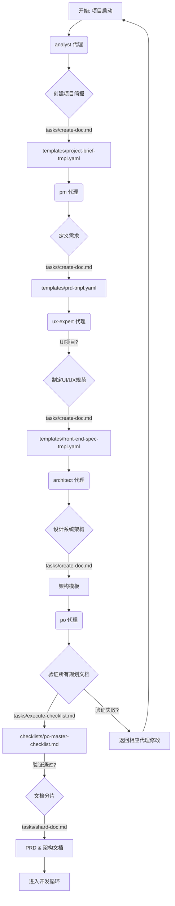
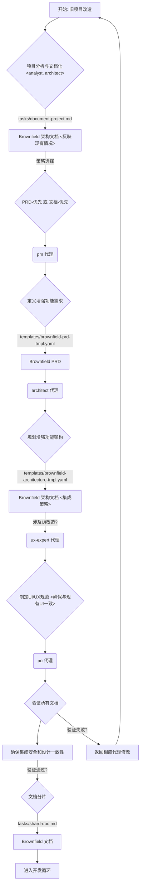
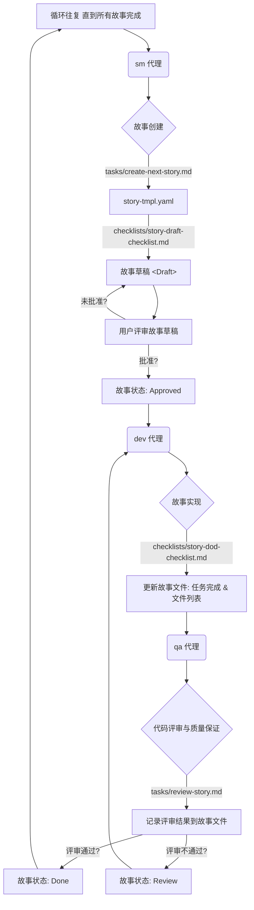
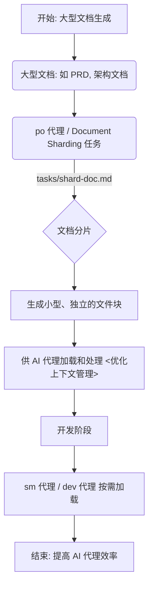
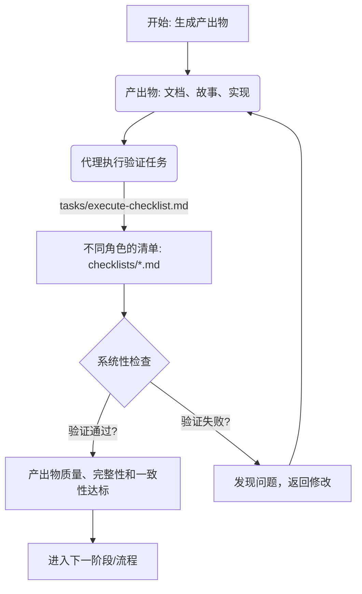
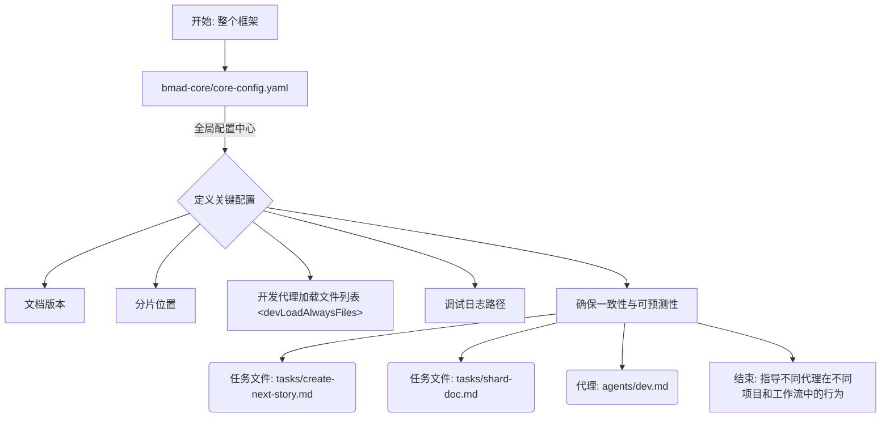
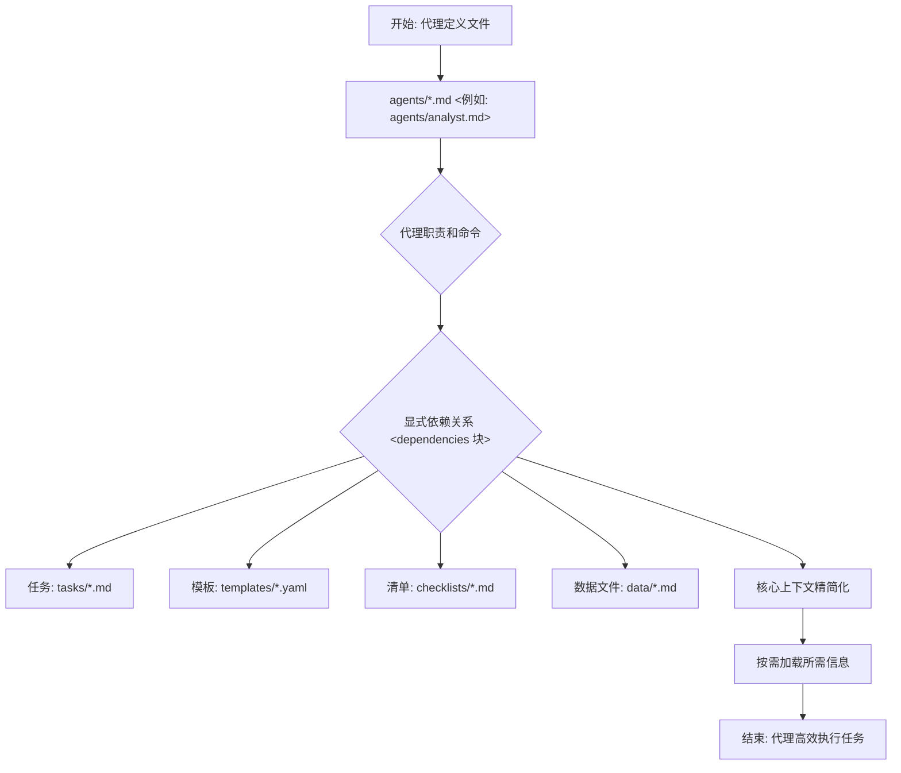
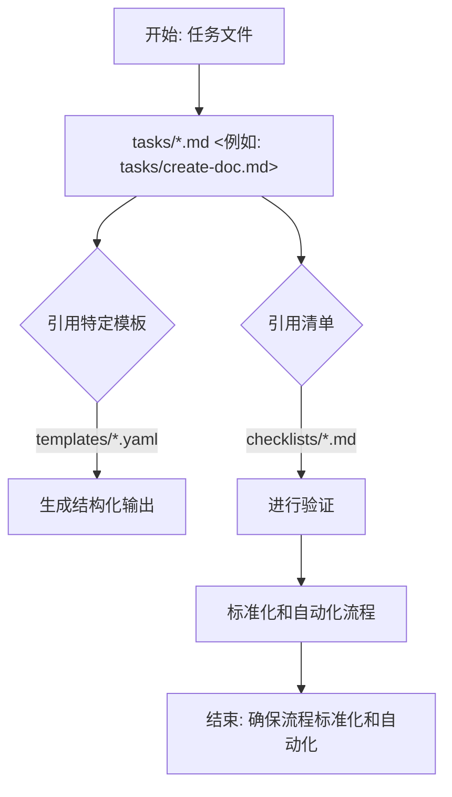
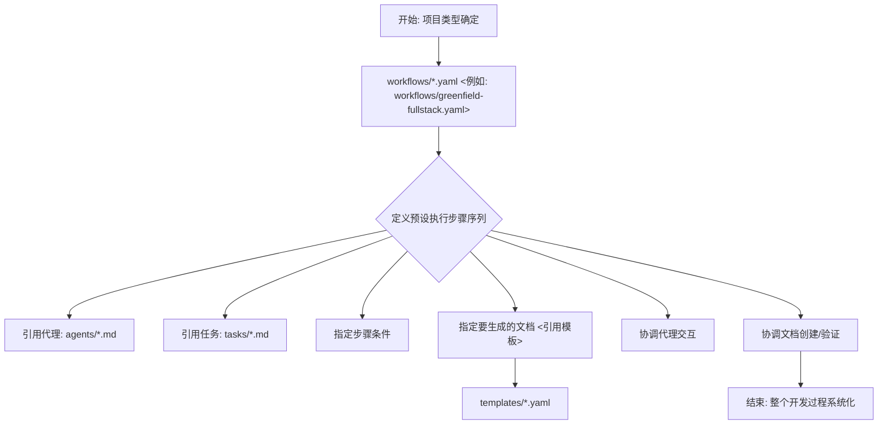

# BMad-Method 业务流程分析报告 v3

## 1. Greenfield (新项目) 工作流流程图

以下是根据 `业务流程分析报告v2.md` 中描述的 Greenfield (新项目) 工作流绘制的流程图。

## 2. Brownfield (旧项目改造) 工作流流程图

以下是根据 `业务流程分析报告v2.md` 中描述的 Brownfield (旧项目改造) 工作流绘制的流程图。

## 3. 迭代开发循环 (SM → Dev → QA) 流程图

以下是根据 `业务流程分析报告v2.md` 中描述的迭代开发循环绘制的流程图。

## 4. 文档分片 (Document Sharding) 机制流程图

以下是根据 `业务流程分析报告v2.md` 中描述的文档分片 (Document Sharding) 机制绘制的流程图。

## 5. 清单验证 (Checklist Validation) 机制流程图

以下是根据 `业务流程分析报告v2.md` 中描述的清单验证 (Checklist Validation) 机制绘制的流程图。

## 6. 核心配置文件 (`core-config.yaml`) 的作用流程图

以下是根据 `业务流程分析报告v2.md` 中描述的核心配置文件 (`core-config.yaml`) 的作用绘制的流程图。

## 7. 代理内部依赖 (`agents/*.md` 中的 `dependencies` 块) 流程图

以下是根据 `业务流程分析报告v2.md` 中描述的代理内部依赖 (`agents/*.md` 中的 `dependencies` 块) 绘制的流程图。

## 8. 任务对模板和清单的引用 (`tasks/*.md`) 流程图

以下是根据 `业务流程分析报告v2.md` 中描述的任务对模板和清单的引用 (`tasks/*.md`) 绘制的流程图。

## 9. 工作流编排 (`workflows/*.yaml`) 流程图

以下是根据 `业务流程分析报告v2.md` 中描述的工作流编排 (`workflows/*.yaml`) 绘制的流程图。

