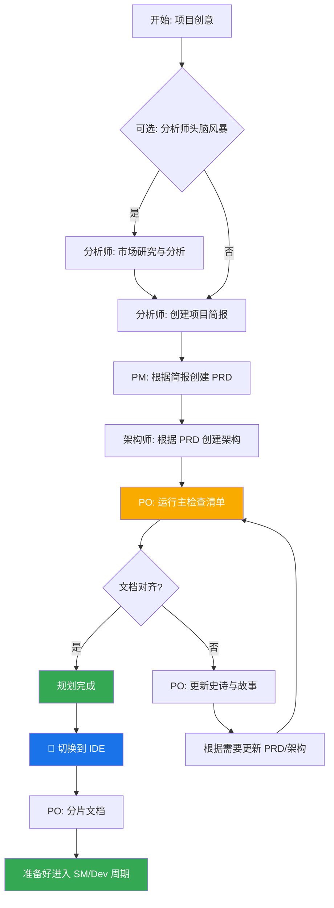
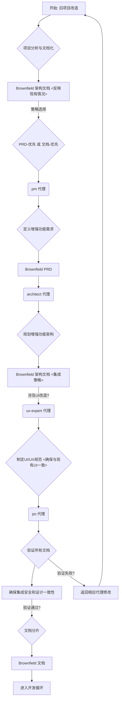
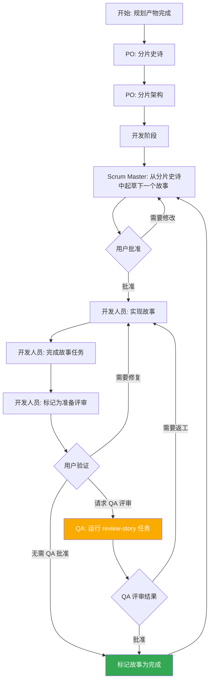
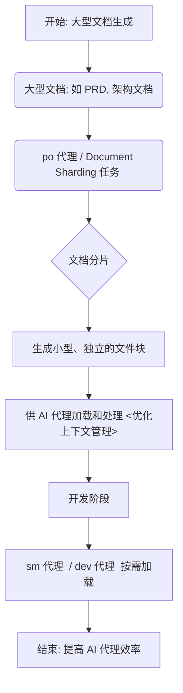
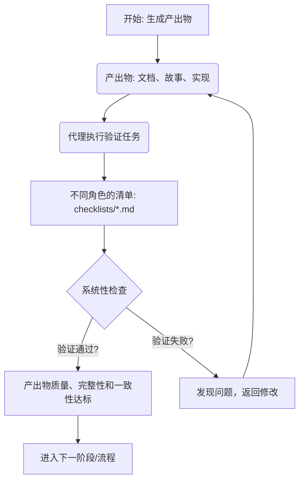
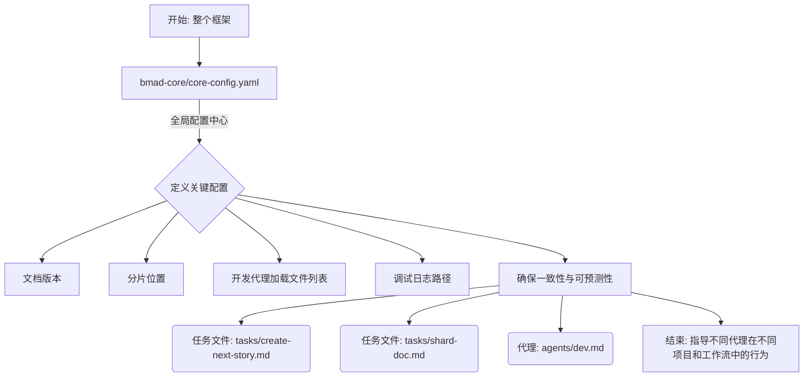
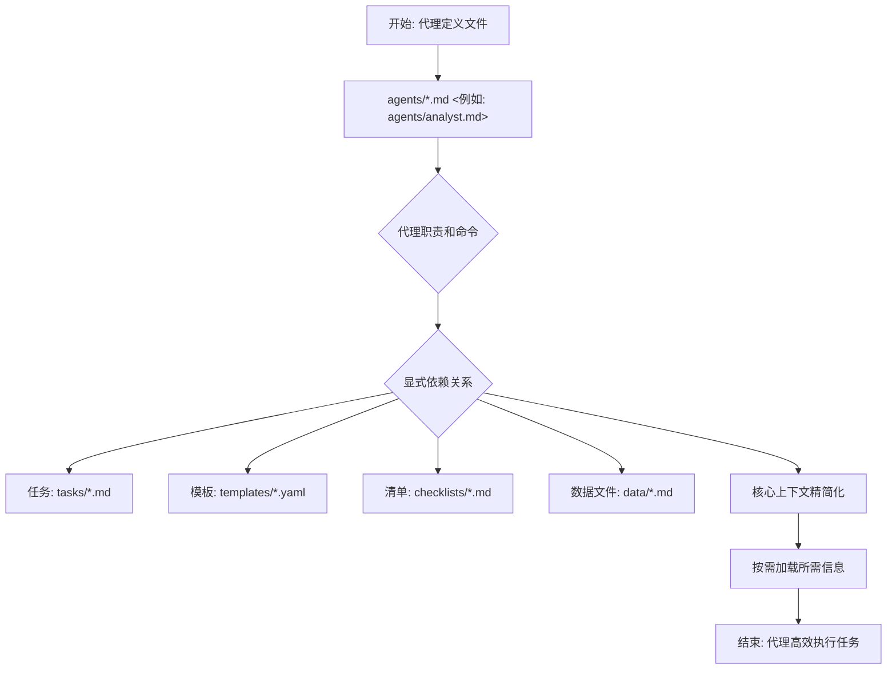
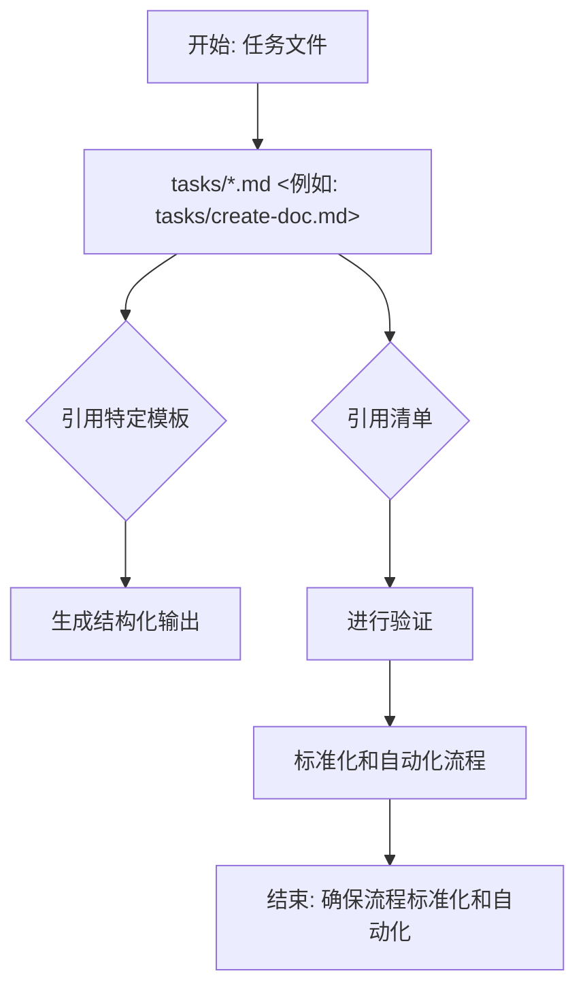
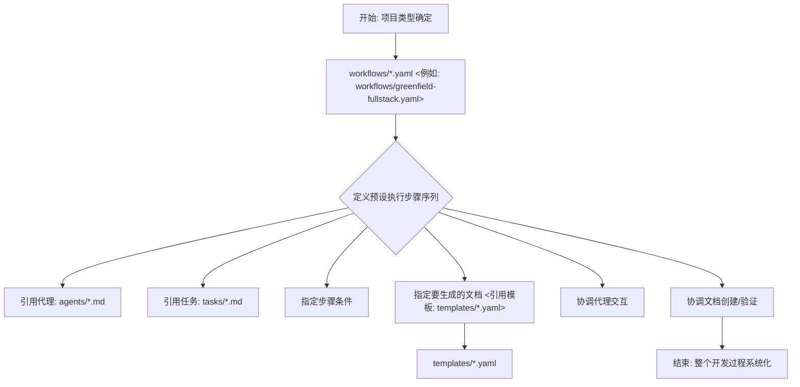

# BMad-Method 业务流程分析报告 v4

本报告基于 BMad Method 的最新文档和版本（特别是 V4 Alpha 的指导原则），对业务流程进行了优化和重新分析。本报告旨在提供一个更符合当前 BMad Method 架构和最佳实践的业务流程视图。

## 1. Greenfield (新项目) 工作流流程图

以下是根据 [`docs/core-architecture.md`](docs/core-architecture.md:150) 中描述的 Planning Workflow 和 `业务流程分析报告v3.md` 中描述的 Greenfield (新项目) 工作流绘制的优化流程图。



**关键规划阶段：**

1.  **可选分析**：分析师进行市场研究和竞争分析。
2.  **项目简报**：由分析师或用户创建的基础文档。
3.  **PRD 创建**：产品经理将简报转化为全面的产品需求。
4.  **架构设计**：架构师根据产品需求创建技术基础。
5.  **验证与对齐**：产品负责人确保所有文档一致且完整。
6.  **精炼**：根据需要更新史诗、故事和文档。
7.  **环境过渡**：从 Web UI 到 IDE 的关键切换，用于开发工作流。
8.  **文档准备**：产品负责人分片大型文档以供开发使用。

**工作流编排**：[`bmad-orchestrator`](bmad-core/agents/bmad-orchestrator.md) 代理使用这些工作流定义来引导用户完成整个过程，确保规划（Web UI）和开发（IDE）阶段之间的适当过渡。

### 1.1. Greenfield (新项目) 工作流最佳实践教程

为了在新项目开发中最大化 BMad Method 的效能，请遵循以下最佳实践：

1.  **充分利用初期规划**：
    *   **目标**：确保项目初期有清晰的需求和方向。
    *   **操作**：启动 [`analyst`](bmad-core/agents/analyst.md) 代理，并给出您的项目创意，让其帮助您创建项目简报。
    *   **指令示例**：
        ```
        @analyst create project brief from idea: "基于用户反馈，开发一个AI驱动的个性化学习平台"
        ```
    *   **预期结果**：分析师代理会提问并生成一个结构化的项目简报文件，例如 `project-brief-YYMMDD.md`。

2.  **标准化文档生成**：
    *   **目标**：通过使用标准模板和任务，确保生成文档的质量和一致性。
    *   **操作**：在项目简报完成后，指示 [`pm`](bmad-core/agents/pm.md) 代理根据简报生成 PRD，随后指示 [`architect`](bmad-core/agents/architect.md) 代理根据 PRD 生成架构文档。
    *   **指令示例**：
        ```
        @pm create PRD using project brief from previous step.
        @architect create architecture based on the PRD.
        ```
    *   **预期结果**：系统会生成 `prd-YYMMDD.md` 和 `architecture-YYMMDD.md` 等文档。

3.  **严格执行检查清单**：
    *   **目标**：在进入开发阶段前，及时发现并纠正规划文档中的问题。
    *   **操作**：指示 [`po`](bmad-core/agents/po.md) 代理运行主检查清单对所有规划文档进行验证。
    *   **指令示例**：
        ```
        @po validate all planning documents.
        ```
    *   **预期结果**：PO 代理会反馈文档的一致性和完整性，并指出需要修改的地方。

4.  **重视文档分片**：
    *   **目标**：优化开发代理的上下文管理，提高其处理效率。
    *   **操作**：在验证通过后，指示 [`po`](bmad-core/agents/po.md) 代理执行文档分片任务。
    *   **指令示例**：
        ```
        @po shard documents for development: PRD, Architecture.
        ```
    *   **预期结果**：大型文档（如 PRD 和架构文档）会被拆分为多个小型、独立的文件块，以便开发代理按需加载。

5.  **持续沟通与反馈**：
    *   **目标**：确保各代理之间以及代理与用户之间的顺畅沟通，及时处理反馈。
    *   **操作**：在任何阶段，如果对代理的输出不满意或需要澄清，直接在对话中提出。
    *   **指令示例**：
        ```
        @analyst 市场研究报告中关于竞品分析的部分不够详细，请补充[特定信息]。
        ```
    *   **预期结果**：代理会根据您的反馈调整其工作。

## 2. Brownfield (旧项目改造) 工作流流程图

本部分基于 `业务流程分析报告v3.md` 的 Brownfield 工作流，并结合 BMad Method 的核心组件和原则进行优化。



### 2.1. Brownfield (旧项目改造) 工作流最佳实践教程

在旧项目改造场景下，BMad Method 能够帮助您系统化地进行分析和增强。以下是关键实践：

1.  **全面理解现有系统**：
    *   **目标**：对现有系统进行深入分析和文档化，为改造奠定基础。
    *   **操作**：启动 [`analyst`](bmad-core/agents/analyst.md) 和 [`architect`](bmad-core/agents/architect.md) 代理，利用 [`tasks/document-project.md`](bmad-core/tasks/document-project.md) 任务来生成反映当前状态的 Brownfield 架构文档。
    *   **指令示例**：
        ```
        @analyst document existing system architecture for "Legacy CRM" focusing on user module and data flow.
        @architect review "Legacy CRM" documentation and propose a refactoring plan for API layer.
        ```
    *   **预期结果**：获得一份详细的现有系统分析报告和初步的改造建议。

2.  **灵活选择改造策略**：
    *   **目标**：根据项目具体情况，选择最适合的改造路径。
    *   **操作**：根据分析结果和团队共识，决定是优先定义详细的需求（PRD-优先）还是优先完善现有文档（文档-优先）。
    *   **指令示例**：
        *   PRD-优先：`@pm define enhancement requirements for "Customer Portal Redesign" based on initial user feedback.`
        *   文档-优先：`@analyst clarify discrepancies in "Old System Documentation" regarding payment processing.`
    *   **预期结果**：清晰的改造需求文档或更完善的现有系统文档。

3.  **利用定制化模板**：
    *   **目标**：确保改造需求和架构规划能够集成现有系统的约束和特性。
    *   **操作**：指示 [`pm`](bmad-core/agents/pm.md) 或 [`architect`](bmad-core/agents/architect.md) 代理使用 Brownfield 专用模板。
    *   **指令示例**：
        ```
        @pm create brownfield PRD for "User Profile Migration" using templates/brownfield-prd-tmpl.yaml.
        @architect plan enhanced architecture for "Reporting Module" considering existing database schema, using templates/brownfield-architecture-tmpl.yaml.
        ```
    *   **预期结果**：符合 Brownfield 特性的产品需求和架构设计文档。

4.  **关注集成安全性与设计一致性**：
    *   **目标**：确保新旧模块之间的集成安全和整体设计的一致性。
    *   **操作**：特别是涉及 UI 改造时，指示 [`ux-expert`](bmad-core/agents/ux-expert.md) 代理在制定规范时与现有 UI 风格统一。
    *   **指令示例**：
        ```
        @ux-expert define UI/UX specifications for "New Dashboard" ensuring consistency with existing admin panel design.
        ```
    *   **预期结果**：一份强调兼容性和一致性的 UI/UX 规范。

5.  **增量式分片与开发**：
    *   **目标**：将改造任务分解为小块，高效进行开发。
    *   **操作**：指示 [`po`](bmad-core/agents/po.md) 代理对 Brownfield 文档进行分片。
    *   **指令示例**：
        ```
        @po shard brownfield documents for "Order Processing" module enhancement.
        ```
    *   **预期结果**：可供开发代理按需加载和处理的文档片段。

## 3. 迭代开发循环 (SM → Dev → QA) 流程图

以下是根据 [`docs/core-architecture.md`](docs/core-architecture.md:195) 中描述的 Core Development Cycle 绘制的优化流程图。



这个循环持续进行，Scrum Master、开发人员和可选的 QA 代理协同工作。QA 代理通过 `review-story` 任务提供高级开发人员评审能力，包括代码重构、质量改进和知识转移。这确保了高代码质量，同时保持开发速度。

### 3.1. 迭代开发循环最佳实践教程

高效的迭代开发是 BMad Method 的核心优势之一。以下是最大化开发效率和质量的关键实践：

1.  **史诗和架构的有效分片**：
    *   **目标**：为 Scrum Master 代理起草故事提供清晰且可管理的上下文。
    *   **操作**：在开发阶段开始前，确保 [`po`](bmad-core/agents/po.md) 代理已将史诗和架构文档通过 [`tasks/shard-doc.md`](bmad-core/tasks/shard-doc.md) 充分分片。
    *   **指令示例**：
        ```
        @po shard epic "User Onboarding" and architecture document "Auth Service Design".
        ```
    *   **预期结果**：分片后的文档可供后续代理加载。

2.  **SM 故事创建的艺术**：
    *   **目标**：Scrum Master 代理起草颗粒度适中、描述清晰的故事。
    *   **操作**：指示 [`sm`](bmad-core/agents/sm.md) 代理根据分片的史诗起草下一个故事。
    *   **指令示例**：
        ```
        @sm create next story from epic "User Authentication Redesign".
        ```
    *   **预期结果**：Scrum Master 代理会提供一个详细的故事草稿供您批准。

3.  **用户积极参与故事评审**：
    *   **目标**：避免开发方向偏差，确保开发人员在正确的故事上投入精力。
    *   **操作**：仔细评审 Scrum Master 代理提供的故事草稿，并给出明确的批准或修改意见。
    *   **指令示例**：
        ```
        User: "批准故事：As a user, I can log in using my Google account."
        User: "故事 '密码重置功能' 需要补充错误处理的场景。"
        ```
    *   **预期结果**：故事状态更新为“Approved”或“Needs Changes”，并继续流转。

4.  **Dev 代理的自组织与自检**：
    *   **目标**：开发人员代理高效实现故事，并进行初步自检。
    *   **操作**：在故事被批准后，[`dev`](bmad-core/agents/dev.md) 代理会开始实现。实现完成后，它会标记为准备评审。
    *   **指令示例**：
        ```
        @dev implement story "As a user, I can log in using my Google account".
        ```
    *   **预期结果**：开发人员代理完成编码并更新故事状态，例如“Ready for Review”。

5.  **QA 代理的价值最大化**：
    *   **目标**：发现潜在问题，提供代码优化建议和知识转移。
    *   **操作**：请求 [`qa`](bmad-core/agents/qa.md) 代理对已实现的故事进行代码评审。
    *   **指令示例**：
        ```
        @qa review story "Implement password reset functionality".
        ```
    *   **预期结果**：QA 代理会提供详细的评审结果，包括发现的问题、改进建议等。

6.  **快速迭代与反馈闭环**：
    *   **目标**：保持开发速度和质量。
    *   **操作**：根据 QA 评审结果或用户验证的反馈，及时指示开发人员代理进行修复或返工。
    *   **指令示例**：
        ```
        User: "根据 QA 评审反馈，请开发人员修复故事 '购物车页面优化' 中的性能问题。"
        ```
    *   **预期结果**：开发人员代理会重新进入实现阶段，并在修复后再次提交评审。

## 4. BMad Method 构建与交付流程

BMad Method 框架主要为两种环境设计：本地 IDE 和基于 Web 的 AI 聊天界面。[`tools/builders/web-builder.js`](tools/builders/web-builder.js) 脚本是支持后者的关键。

### 4.1. Web Builder (`tools/builders/web-builder.js`)

-   **目的**：此 Node.js 脚本负责创建 `dist` 目录中的 `.txt` 包。
-   **过程**：
    1.  **解析依赖**：对于给定的代理或团队，脚本读取其定义文件。
    2.  它递归地查找代理/团队所需的所有依赖资源（任务、模板等）。
    3.  **打包内容**：它读取所有这些文件的内容，并将它们连接成一个大的文本文件，其中包含清晰的分隔符，指示每个部分的原始文件路径。
    4.  **输出包**：最终的 `.txt` 文件保存在 `dist` 目录中，准备上传到 Web UI。

### 4.2. 特定环境用法

-   **对于 IDE**：用户直接通过 `bmad-core/agents/` 中的 markdown 文件与代理交互。IDE 集成（例如用于 Cursor、Claude Code 等）知道如何调用这些代理。
-   **对于 Web UI**：用户上传 `dist` 中预构建的包。这个单一文件为 AI 提供了整个团队及其所需的所有工具和知识的上下文。

## 5. 核心组件优化说明

### 5.1. 文档分片 (Document Sharding) 机制流程图

文档分片是 BMad Method 优化 AI 代理上下文管理的关键机制，特别是在处理大型文档时。此机制通过将大型文档（如 PRD、架构文档）分解为更小、独立的文件块，以便 AI 代理可以按需加载和处理，从而提高效率。



### 5.2. 清单验证 (Checklist Validation) 机制流程图

清单验证是 BMad Method 确保产出物质量、完整性和一致性的重要环节。通过在不同阶段（如文档、故事、实现生成后）由代理执行验证任务并引用特定清单 (`checklists/*.md`)，实现系统性检查。



### 5.3. 核心配置文件 (`core-config.yaml`) 的作用流程图

`bmad-core/core-config.yaml` 文件作为 BMad Method 的全局配置中心，定义了文档版本、分片位置、开发代理加载文件列表（`devLoadAlwaysFiles`）和调试日志路径等关键配置，确保整个框架的一致性和可预测性，并指导不同代理在不同项目和工作流中的行为。



### 5.4. 代理内部依赖 (`agents/*.md` 中的 `dependencies` 块) 流程图

代理定义文件（`agents/*.md`）中的 `dependencies` 块明确了代理职责和命令所需的显式依赖关系，包括任务、模板、清单和数据文件。这有助于实现核心上下文的精简化，并通过按需加载所需信息来确保代理高效执行任务。



### 5.5. 任务对模板和清单的引用 (`tasks/*.md`) 流程图

任务文件（`tasks/*.md`）通过引用特定模板（`templates/*.yaml`）来生成结构化输出，并通过引用清单（`checklists/*.md`）进行验证。这种机制确保了流程的标准化和自动化，特别是通过复用 [`common/tasks/create-doc.md`](common/tasks/create-doc.md) 等通用任务来创建文档，从而减少重复并保持一致性。



### 5.6. 工作流编排 (`workflows/*.yaml`) 流程图

工作流编排（`workflows/*.yaml`，例如 [`workflows/greenfield-fullstack.yaml`](bmad-core/workflows/greenfield-fullstack.yaml)）定义了预设的执行步骤序列，引用代理和任务，并指定步骤条件以及要生成的文档。它协调代理交互和文档创建/验证，从而系统化整个开发过程。



## 6. BMAD Method 指导原则

BMad Method 作为一个 AI 辅助软件开发的自然语言框架，遵循以下核心指导原则，以确保其有效性：

### 6.1. 开发代理必须精益 (Dev Agents Must Be Lean)

-   **最小化开发代理依赖**：在 IDE 中工作的开发代理必须具有最小的上下文开销。
-   **为代码节省上下文**：每一行都很重要——开发代理应该专注于编码，而不是文档。
-   **Web 代理可以更大**：在 Web UI 中使用的规划代理（PRD 编写者、架构师）可以具有更复杂的任务和依赖。
-   **小文件，按需加载**：多个小而集中的文件优于包含许多分支的大文件。

### 6.2. 自然语言优先 (Natural Language First)

-   **一切皆为 Markdown**：代理、任务、模板——都以纯英文编写。
-   **核心中没有代码**：框架本身不包含编程代码，只有自然语言指令。
-   **自包含模板**：模板被定义为 YAML 文件，其中包含结构化部分，包括元数据、工作流配置和内容生成的详细说明。

### 6.3. 代理和任务设计 (Agent and Task Design)

-   **代理定义角色**：每个代理都是具有特定专业知识的角色（例如，前端开发人员、API 开发人员）。
-   **任务是过程**：代理遵循的逐步说明以完成工作。
-   **模板是输出**：具有嵌入式生成说明的结构化文档。
-   **依赖关系很重要**：明确声明所需的依赖。

### 6.4. 何时添加核心，何时创建扩展包

-   **何时添加到核心**：
    *   仅限通用软件开发需求。
    *   不会膨胀开发代理上下文。
    *   遵循现有的代理/任务/模板模式。
-   **何时创建扩展包**：
    *   超越软件开发领域特定需求。
    *   非技术领域（业务、健康、教育、创意）。
    *   专业技术领域（游戏、基础设施、移动）。
    *   大量文档或知识库。
    *   任何会膨胀核心代理的内容。

参阅 [`docs/expansion-packs.md`](docs/expansion-packs.md:1) 获取详细示例和想法。